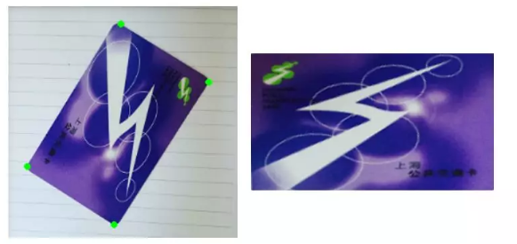
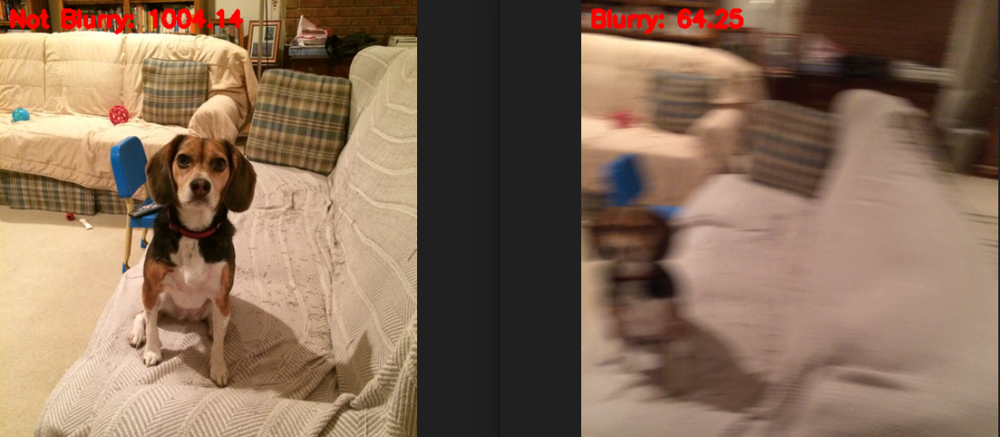
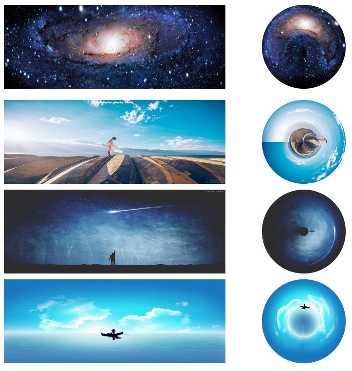
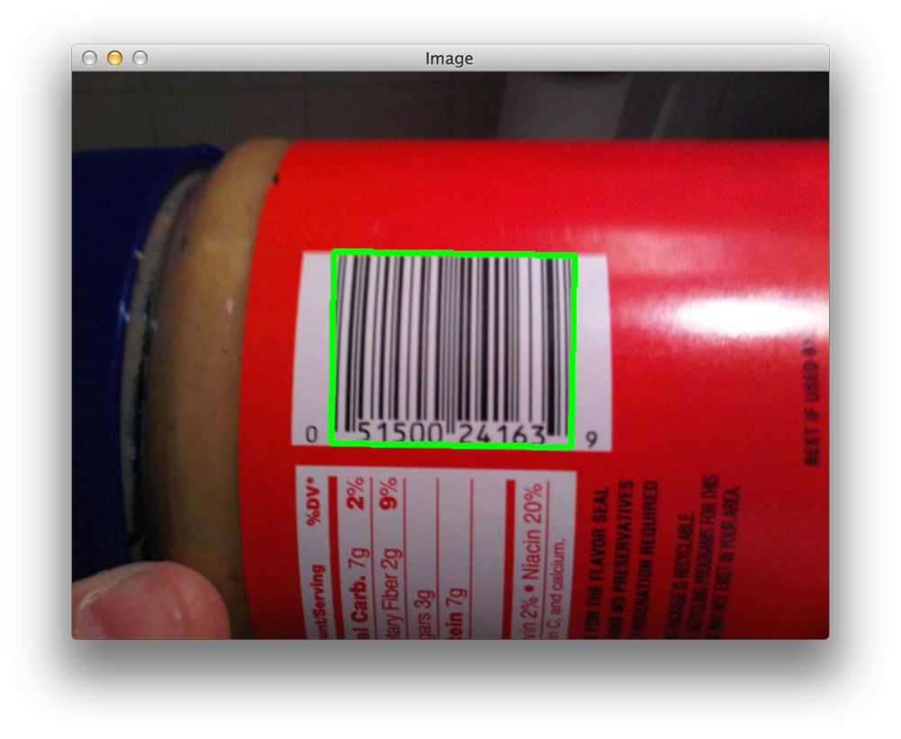
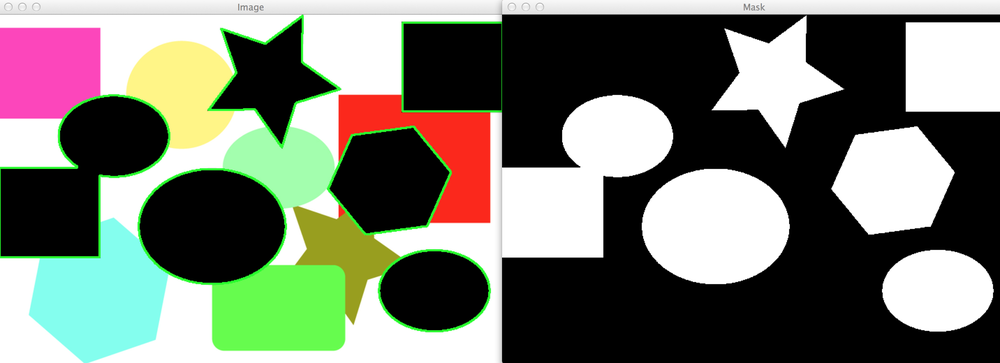
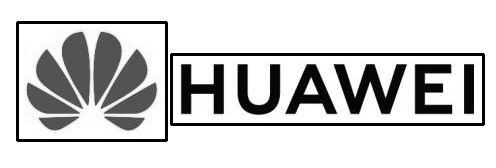

# AI_study
本板块用于记录学习机器学习和深度学习中的一些操作和知识

计划包括以下几部分的内容：

[计算机视觉算法岗面经整理——点击可查看完整面经目录](https://github.com/DWCTOD/interview)

[数字图像处理——传统图像处理..未完成](https://github.com/DWCTOD/AI_study/tree/master/%E5%90%88%E6%A0%BC%E7%9A%84CV%E5%B7%A5%E7%A8%8B%E5%B8%88/%E6%95%B0%E5%AD%97%E5%9B%BE%E5%83%8F%E5%A4%84%E7%90%86%E7%AF%87)

代码能力——python和leetcode

机器学习理论

深度学习理论

[实战方面](https://github.com/DWCTOD/AI_study/tree/master/%E5%90%88%E6%A0%BC%E7%9A%84CV%E5%B7%A5%E7%A8%8B%E5%B8%88/%E5%AE%9E%E6%88%98%E7%AF%87)

- [opencv..正在进行中](https://github.com/DWCTOD/AI_study/tree/master/%E5%90%88%E6%A0%BC%E7%9A%84CV%E5%B7%A5%E7%A8%8B%E5%B8%88/%E5%AE%9E%E6%88%98%E7%AF%87/opencv)

| 项目                                                         |                           效果展示                           | 代码链接                                                     |
| ------------------------------------------------------------ | :----------------------------------------------------------: | ------------------------------------------------------------ |
| [opencv实现一只奶凶奶凶的科技猫](https://mp.weixin.qq.com/s?__biz=MzU4NTY4Mzg1Mw==&mid=2247504535&idx=1&sn=223aec3862b8d717db76fe8ba95ee3ae&chksm=fd845475caf3dd63ee76654c99aa5bcc38b18aab117cafd4d9eb87dc9d9ed9403d8729ee0951&token=1331840361&lang=zh_CN#rd)   1、Gabor滤波器的使用 2、对特征重新赋值 3、滑动条使用 |   使用方法运行 main.py 即可 | [求star](https://github.com/DWCTOD/AI_study/tree/master/%E5%90%88%E6%A0%BC%E7%9A%84CV%E5%B7%A5%E7%A8%8B%E5%B8%88/%E5%AE%9E%E6%88%98%E7%AF%87/opencv/10-gabor) |
| [复现扫描全能王APP矫正功能](https://mp.weixin.qq.com/s?__biz=MzU4NTY4Mzg1Mw==&mid=2247485094&idx=1&sn=f070ff1265b8536129974543f18e6723&chksm=fd878044caf009527382a3aa74b4cbb6315fa8799d1c3ad1e9da7fa22634121e82dedda87c01&token=1964235149&lang=zh_CN#rd) 1、分析 扫描全能王APP的功能和原理 2、通过图像处理的技术（透视变换）实现矫正  |   使用方法：运行 *几何矫正.py* 即可 | [求star](https://github.com/DWCTOD/AI_study/tree/master/%E5%90%88%E6%A0%BC%E7%9A%84CV%E5%B7%A5%E7%A8%8B%E5%B8%88/%E5%AE%9E%E6%88%98%E7%AF%87/opencv/%EF%BC%88%E4%B8%80%EF%BC%89%E5%9B%BE%E5%83%8F%E6%89%AB%E6%8F%8F%E5%8A%9F%E8%83%BD%E2%80%94%E2%80%94%E5%87%A0%E4%BD%95%E7%9F%AB%E6%AD%A3) |
| [自动识别模糊图片](https://mp.weixin.qq.com/s?__biz=MzU4NTY4Mzg1Mw==&mid=2247485111&idx=1&sn=14dea49b6734d8b0022de1f37c00b0df&chksm=fd878055caf00943c1260c41e56789976fa44308b987699b313cf56d084d37891efe32d2a2cb&token=1298394169&lang=zh_CN#rd) 1、分析图片模糊的原因 2、对图片进行拉普拉斯变换后计算方差 3、设置方差阈值实现对模糊图片的查找  |   使用方法： python3  detect_blur.py -i images | [求star](https://github.com/DWCTOD/AI_study/tree/master/%E5%90%88%E6%A0%BC%E7%9A%84CV%E5%B7%A5%E7%A8%8B%E5%B8%88/%E5%AE%9E%E6%88%98%E7%AF%87/opencv/%EF%BC%88%E4%BA%8C%EF%BC%89%E6%A8%A1%E7%B3%8A%E5%9B%BE%E5%83%8F%E6%A3%80%E6%B5%8B) |
| [用一种魔鬼的方式打开cxk](https://mp.weixin.qq.com/s?__biz=MzU4NTY4Mzg1Mw==&mid=2247485163&idx=1&sn=e71aee122b6b3d8c83dabaa62a4a6d37&chksm=fd878009caf0091ff542f49652ab074adc86197f1eaae39a7e6bd6e209a885263a1b7193fd08&token=293788954&lang=zh_CN#rd) 1、实现将图片、gif和视频转为字符形式 2、帮助理解数字图像的本质  |  使用方法：python3  gif2word.py | [求star](https://github.com/DWCTOD/AI_study/tree/master/%E5%90%88%E6%A0%BC%E7%9A%84CV%E5%B7%A5%E7%A8%8B%E5%B8%88/%E5%AE%9E%E6%88%98%E7%AF%87/opencv/%EF%BC%88%E4%B8%89%EF%BC%89%E7%94%A8%E5%AD%97%E7%AC%A6%E6%96%B9%E5%BC%8F%E8%A1%A8%E7%A4%BA%E5%9B%BE%E7%89%87%EF%BC%8C%E8%BF%99%E7%A7%8D%E6%96%B9%E5%BC%8F%E7%AE%80%E7%9B%B4%E6%98%AF%E9%AD%94%E9%AC%BC) |
| [极坐标全景图](https://mp.weixin.qq.com/s?__biz=MzU4NTY4Mzg1Mw==&mid=2247485204&idx=1&sn=a674686d7d137783f3ef5f6e309f9ce3&chksm=fd8781f6caf008e0f9463ad090f77a617ad9cd59016218224d1410bf884db0642b7104563ba3&token=28660477&lang=zh_CN#rd) 1、媲美PS的酷炫效果 2、原理蕴含了数学之美，值得去学习和研究 |  使用方法：python3 极坐标全景图.py | [求star](https://github.com/DWCTOD/AI_study/tree/master/%E5%90%88%E6%A0%BC%E7%9A%84CV%E5%B7%A5%E7%A8%8B%E5%B8%88/%E5%AE%9E%E6%88%98%E7%AF%87/opencv/%EF%BC%88%E5%9B%9B%EF%BC%89%E5%AE%9E%E7%8E%B0%E7%82%AB%E9%85%B7%E7%9A%84%E5%85%A8%E6%99%AF%E5%9B%BE%E6%95%88%E6%9E%9C) |
| [检测图像中的条形码](https://mp.weixin.qq.com/s?__biz=MzU4NTY4Mzg1Mw==&mid=2247485241&idx=1&sn=a4317d09bc51990c12ed14e20af22f80&chksm=fd8781dbcaf008cd919344ef164f1786cb1261b8136296e2e61fbf91697a17f9508bb3a9b65b&token=478022544&lang=zh_CN#rd) 1、 图像处理中常用的一些操作流程，包括滤波、阈值化处理、膨胀、腐蚀和轮廓查找等 2、实现准确查找到条形码的位置并框选出来 |  使用方法： python3 detect_barcode.py --image images/barcode_01.jpg | [求star](https://github.com/DWCTOD/AI_study/tree/master/%E5%90%88%E6%A0%BC%E7%9A%84CV%E5%B7%A5%E7%A8%8B%E5%B8%88/%E5%AE%9E%E6%88%98%E7%AF%87/opencv/%EF%BC%88%E4%BA%94%EF%BC%89%E7%94%A8python%E5%92%8Copencv%E6%A3%80%E6%B5%8B%E5%9B%BE%E5%83%8F%E4%B8%AD%E7%9A%84%E6%9D%A1%E5%BD%A2%E7%A0%81) |
| [OpenCV测量物体的尺寸技能 get～](https://mp.weixin.qq.com/s?__biz=MzU4NTY4Mzg1Mw==&mid=2247485286&idx=1&sn=735eacfb97ff04bd04edc22fc42ec378&chksm=fd878184caf008929b57ff878987475821e894875afe77369c974d7f97b77584c50f0078c36d&token=320540311&lang=zh_CN#rd) 1、利用图像的方法对物体的尺寸进行测量 2、需有一个易于识别并已知尺寸的参考物体 |  使用方法：  python3 object_size.py --image images/example_01.png --width 0.955 | [求star](https://github.com/DWCTOD/AI_study/tree/master/%E5%90%88%E6%A0%BC%E7%9A%84CV%E5%B7%A5%E7%A8%8B%E5%B8%88/%E5%AE%9E%E6%88%98%E7%AF%87/opencv/%EF%BC%88%E5%85%AD%EF%BC%89%E5%88%A9%E7%94%A8python%E5%92%8COpenCV%E6%B5%8B%E9%87%8F%E7%89%A9%E4%BD%93%E7%9A%84%E5%A4%A7%E5%B0%8F) |
| [opencv物体查找形状](https://github.com/DWCTOD/AI_study/blob/master/%E5%90%88%E6%A0%BC%E7%9A%84CV%E5%B7%A5%E7%A8%8B%E5%B8%88/%E5%AE%9E%E6%88%98%E7%AF%87/opencv/%EF%BC%88%E4%B8%83%EF%BC%89%E4%BD%BF%E7%94%A8python%E5%92%8COpenCV%E6%9F%A5%E6%89%BE%E5%9B%BE%E5%83%8F%E4%B8%AD%E7%9A%84%E5%BD%A2%E7%8A%B6/%E4%BD%BF%E7%94%A8python%E5%92%8Copencv%E6%9F%A5%E6%89%BE%E5%9B%BE%E5%83%8F%E4%B8%AD%E7%9A%84%E5%BD%A2%E7%8A%B6.md) |  使用方法： python3 find_shapes.py --image shapes.png | [求star](https://github.com/DWCTOD/AI_study/tree/master/%E5%90%88%E6%A0%BC%E7%9A%84CV%E5%B7%A5%E7%A8%8B%E5%B8%88/%E5%AE%9E%E6%88%98%E7%AF%87/opencv/%EF%BC%88%E4%B8%83%EF%BC%89%E4%BD%BF%E7%94%A8python%E5%92%8COpenCV%E6%9F%A5%E6%89%BE%E5%9B%BE%E5%83%8F%E4%B8%AD%E7%9A%84%E5%BD%A2%E7%8A%B6) |
| [还在用肉眼找不同吗？这个技术轻松搞定](https://mp.weixin.qq.com/s?__biz=MzU4NTY4Mzg1Mw==&mid=2247485322&idx=1&sn=c846901d286c55df6a3144d653861eb5&chksm=fd878168caf0087e1461cee943f93064d7567b77dd730bdadef6b438e2cfb5b7d2b2bbaf08b4&token=1256419766&lang=zh_CN#rd) |  使用方法：python3 i image_diff.py | [求star](https://github.com/DWCTOD/AI_study/tree/master/%E5%90%88%E6%A0%BC%E7%9A%84CV%E5%B7%A5%E7%A8%8B%E5%B8%88/%E5%AE%9E%E6%88%98%E7%AF%87/opencv/%EF%BC%887%EF%BC%89%E5%AF%B9%E6%AF%94%E5%9B%BE%E7%89%87%E7%9A%84%E4%B8%8D%E5%90%8C) |
| [图像拼接](https://mp.weixin.qq.com/s?__biz=MzU4NTY4Mzg1Mw==&mid=2247485654&idx=1&sn=be5c0663586fd5ae79f9ddafa1427fa8&chksm=fd878e34caf00722c210b5f19933b49aeeb57939d37e8c88249634ee4cda8b7831fc8105ff4b&scene=27#wechat_redirect) |                           | [求star](https://github.com/DWCTOD/AI_study/tree/master/%E5%90%88%E6%A0%BC%E7%9A%84CV%E5%B7%A5%E7%A8%8B%E5%B8%88/%E5%AE%9E%E6%88%98%E7%AF%87/opencv/%EF%BC%88%E5%85%AB%EF%BC%89%E5%9B%BE%E5%83%8F%E6%8B%BC%E6%8E%A5%E6%8A%80%E6%9C%AF) |
| [logo检测]()                                                 |                            | [求star](https://github.com/DWCTOD/AI_study/tree/master/%E5%90%88%E6%A0%BC%E7%9A%84CV%E5%B7%A5%E7%A8%8B%E5%B8%88/%E5%AE%9E%E6%88%98%E7%AF%87/opencv/%EF%BC%88%E4%B9%9D%EF%BC%89logo%E6%A3%80%E6%B5%8B) |

- [tensorflow..未完成](https://github.com/DWCTOD/AI_study/tree/master/%E5%90%88%E6%A0%BC%E7%9A%84CV%E5%B7%A5%E7%A8%8B%E5%B8%88/%E5%AE%9E%E6%88%98%E7%AF%87/tensorflow)

[论文阅读](https://github.com/DWCTOD/AI_study/tree/master/%E5%90%88%E6%A0%BC%E7%9A%84CV%E5%B7%A5%E7%A8%8B%E5%B8%88/%E8%AE%BA%E6%96%87%E9%98%85%E8%AF%BB%E7%AF%87)

各个研究方向的总结

[图像检索..未完成](https://github.com/DWCTOD/AI_study/tree/master/%E5%90%88%E6%A0%BC%E7%9A%84CV%E5%B7%A5%E7%A8%8B%E5%B8%88/%E5%9B%BE%E5%83%8F%E6%A3%80%E7%B4%A2)

[图像分割..未完成](https://github.com/DWCTOD/AI_study/tree/master/%E5%90%88%E6%A0%BC%E7%9A%84CV%E5%B7%A5%E7%A8%8B%E5%B8%88/%E5%9B%BE%E5%83%8F%E5%88%86%E5%89%B2)

- FCN
- SegNet
- Enet

main.py utils.py 是集成分类器模型

