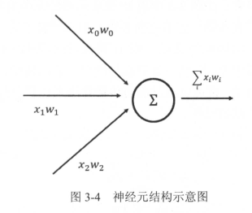

# 前向传播算法简介

## 神经元结构

为了介绍神经网络的前向传播算法 , 需要先了解神经元的结构。神经元是构成一 个神经网络的最小单元,图 3-4 显示了 一个最简单的神经元结构 。如图 3-4 所示, 一个最简单的神经元结构的输出就是所有输入的加权和,而不同输入的权重就是神经元的参数。



## 神经网络参数与TensorFlow变量

神经网络中的参数是神经网络实现分类或者回归问题中重要的部分 。

在 TensorFlow 中,变量 ( tf. Variable )的作用就是保存和更新神经网络中的参数 ，TensorFlow中的变量也需要指定初始值 。

TensorFlow支持的所有随机数生成器如下：

|      函数名称       |                          随机数分布                          |               主要参数                |
| :-----------------: | :----------------------------------------------------------: | :-----------------------------------: |
|  tf.random_normal   |                           正态分布                           |       平均值、标准差、取值类型        |
| tf.truncated_normal | 正态分布，但如果随机出来的值偏离平均值超过2个标准差，那么这个数将会被重新随机 |       平均值、标准差、取值类型        |
|  tf.random_uniform  |                           均匀分布                           |        最小、最大值、取值类型         |
|   tf.random_gamma   |                          Gamma分布                           | 形状参数alpha、尺寸参数beta、取值类型 |

TensorFlow中常用的常量声明方法：

| 函数名称    | 功能                         | 样例                                     |
| ----------- | ---------------------------- | ---------------------------------------- |
| tf.zeros    | 产生全0的数组                | tf.zeros([2,3],int32)->[[0,0,0],[0,0,0]] |
| tf.ones     | 产生全1的数组                | tf.ones([2,3],int32)->[[1,1,1],[1,1,1]]  |
| tf.fill     | 产生一个全部为给定数字的数组 | tf.fill([2,3],9)->[[9,9,9],[9,9,9]]      |
| tf.constant | 产生一个给定值的常量         | tf.constant([1,2,3])->[1,2,3]            |

接下来演示一下通过变量实现神经网络的参数以及前向传播的过程。


```
import tensorflow as tf
# 声明 w1 、 w2 两个变盘。这里还通过 seed 参数设定了随机种子,
# 这样可以保证每次运行得到的结果是一样的。
w1 = tf.Variable(tf.random_normal((2, 3) , stddev=1 , seed=1))
w2 = tf.Variable(tf .random_normal((3, 1), stddev=1, seed=1))
# 暂时将输入的特征向盘定义为 一个常量。注意这里 x 是一个 1x2 的矩阵。
x = tf.constant([[0.7, 0.9]])
# 通过 3.4.2 节描述的前向传播算法获得神经网络的输出。
a = tf.matmul (x, w1)
y = tf.matmul(a, w2)
sess = tf.Session()
# 与 3.4.2 中的计算不同,这里不能直接通过 sess.run (y)来获取 y 的取值,
# 因为 wl 和 w2 都还没有运行初始化过程。以下两行分别初始化了 wl 和 w2 两个变量。
sess.run(w1.initializer)
sess.run(w2.initializer)
# 初始化 w1.
# 初始化 w2.
# 输出[( 3.95757794 ))。
print(sess.run(y))
sess.close()
```

- [ ] 定义计算
- [ ] 执行会话

从这段代码可以看到,当声明了变量 w1 、w2 之后,可以通过 w1和 w2 来定义神经网络的前向传播过程并得到中间结果 a 和最后答案 y 。定义 wl 、 w2, a 和 y 的过程是 TensorFlow 程序的第一步。这一步定义了 TensorFlow 计算图中所有的计算,但这些被定义的计算在这一步中并不真正地运行。当需要运行这些计算并得到具体数字时,需要进入 TensorFlow 程序的第二步。
在 TensorFlow 程序的第二步会声明一个会话( session),并通过会话计算结果在上面的样例中, 当会话定义完成之后就可以开始真正运行定义好的计算了。但在计算 y 之前,需要将所有用到的变量初始化 。 也就是说,虽然在变 量定义时给出了变量 初始化的方法,但这个方法并没有被真正运行。所以在计算 y 之前,需要通过运行 w 1. initializer 和w2. initializer 来给变量赋值。虽然直接调用每个变量的初始化过程是一个可行的方案,但是当变量数目增多,或者变量之间存在依赖关系时,单个调用的方案就比较麻烦了。为了解决这个问题, TensorFlow 提供了一种更加便捷的方式来完成变量初始化过程 以下程序展示了通过 tf.global_ variables_ initializer 函数实现初始化所有变量的过程 。

```
init_op = tf.global_variables_initializer()
sess.run(init_op)
```

通过 tf.global_ variables _initializer函数,就不需要将变量一个一个初始化了 。这个函数也会自动处理变量之间的依赖关系。

- [ ] 通过placeholder实现前向传播算法

神经网络的训练过程会需要经过几百万轮甚至几亿轮的迭代，这样计算图就会非常大，而且利用率很低 。 为了避免这个问题， TensorFlow 提供了 placeholder 机制用于提供输入数据 。

placeholder相当于定义了 一个位置，这个位置中的数据在程序运行时再指定 。这样在程序中就不需要生成大量常量来提供输入数据，而只需要将数据通过 placeholder 传入TensorFlow 计算图 。在 placeholder 定义时，这个位置上的数据类型是需要指定的。和其他张量一样， placeholder 的类型也是不可以改变的。 placeholder 中数据的维度信息可以根据提供的数据推导得出，所以不一定要给出。下面给出了通过 placeholder 实现前向传播算法的代码：

```
import tensorflow as tf
w1 = tf.Variable(tf.random_normal([2,3],stddev=1,seed=1))
w2 = tf.Variable(tf.random_normal([3,1],stddev=1,seed=1))
# 定义placeholder作为存放输入数据的地方。这里维度也不一定要定义。
# 但如果维度是确定的，那么给出维度可以降低出错的概率。
x = tf.placeholder(tf.float32,shape=(1,2),name="input")
a = tf.matmul(x, w1)
y = tf.matmul(a, w2)
sess = tf.Session()
init_op = tf.global_variables_initializer()
sess.run(init_op)
# 下面一行将报错：InvalidArgumentError:You must feed a value for placeholder
# tensor 'input_1' with dtype float and shape [1,2]
# print(sess.run(y))
# 下面一行将会得到与前面一样的输出结果
print(sess.run(y,feed_dict={x:[[0.7,0.9]]}))
```

在这段程序中替换了原来通过常量定义的输入 x 。在新 的程序中计算前向传播结果时，需要提供一个 feed_dict 来指定 x 的取值 。feed_dict 是一个字 典( map )，在字典中 需要给 出每个用到的laceholder 的取值。如果某个需要的 placeholder 没有被指定取值,那么程序在运行时将会报错。