> 本文仅用于自己个人学习如有侵权请告知 公众号：AI算法与图像处理  删除，谢谢！
>
> 参考和来源：有三AI，https://zhuanlan.zhihu.com/p/66050456

> 今天开启新的专栏《图像分割模型》。在这里，我们将共同探索解决分割问题的主流网络结构和设计思想，这是第1篇文章。
>
> 今天要说的是占据了图像分割编解码结构大半江山的Fully Convolutional Network（FCN）。
>
>  作者 | 孙叔桥
>
> 编辑 | 言有三

## 图像分割模型——FCN

FCN开源代码：https://github.com/shelhamer/fcn.berkeleyvision.org

其他优质参考文章：https://blog.csdn.net/qq_36269513/article/details/80420363

> 1、什么是分割

分割，顾名思义，就是把一个完整的东西按照某种方式或规则分成若干个部分。

那么什么是图像分割呢？简单来说，就是把图像中属于同一类别或同一个体的东西划分在一起，并将各个子部分区分开来。像下图这样：

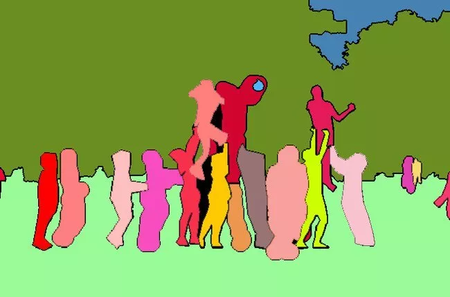

为了训练神经网络，图片中这些**像素点**会按照某种规则被贴上一个**“标签”**，比如这个像素点是属于人、天空、草地还是树；更详细一点，可以再给它们第二个标签，声明它们是属于“哪一个人”或“哪一棵树”。

对于只有一个标签的（只区分类别）的任务，我们称之为“语义分割”（semantic segmentation）；对于区分相同类别的不同个体的，则称之为实例分割（instance segmentation）。由于实例分割往往只能分辨可数目标，因此，为了同时实现实例分割与不可数类别的语义分割，2018年Alexander Kirillov等人提出了全景分割（panoptic segmentation）的概念。

下图分别展示了（a）原始图像，（b）语义分割，（c）实例分割和（d）全景分割。

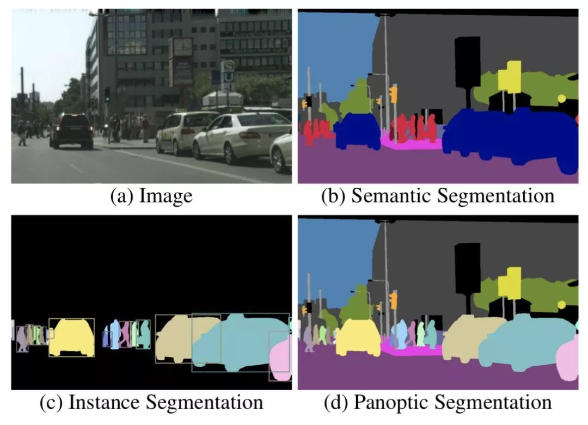

> 2、FCN

目前在图像分割领域比较成功的算法，有很大一部分都来自于同一个先驱：Long等人提出的Fully Convolutional Network（FCN），也就是今天我们要讨论的网络结构。FCN将分类网络转换成用于分割任务的网络结构，并证明了在分割问题上，可以实现端到端的网络训练。基于此，FCN成为了深度学习解决分割问题的奠基石。

目标识别网络（分类网络）尽管表面上来看可以接受任意尺寸的图片作为输入，但是由于网络结构最后全连接层的存在，使其**丢失了输入的空间信息**，因此，这些网络并没有办法直接用于解决诸如分割等稠密估计的问题。

考虑到这一点，**FCN用卷积层和池化层替代了分类网络中的全连接层**，从而使得网络结构可以适应像素级的稠密估计任务。如下图所示，这种全卷积网络结构不仅能够支持稠密估计，而且能够实现端到端的训练。

**输入：**整幅图像。

**输出：**空间尺寸与输入图像相同，通道数等于全部类别个数。（**备注，每个通道表示对应类别的置信度）**

**真值：**通道数为1（或2）的分割图像。

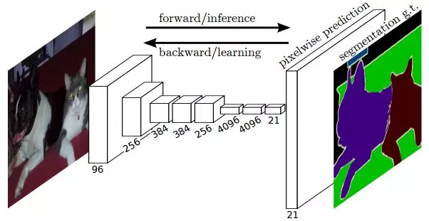

**（1）全连接层转换成卷积层**

如前文所述，将全连接层替换成卷积层的优势之一，是可以使网络用于稠密估计任务，并实现端到端训练。比如下图中，将全连接层替换成卷积层后，可以使得网络输出一个热度图（heatmap），而非单个类别标签。

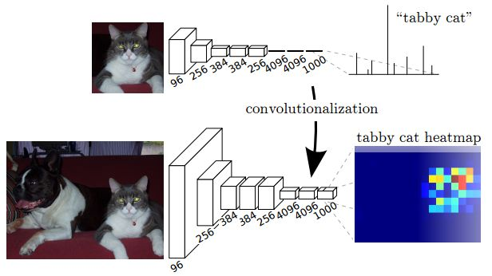

而这种做法的另外一个优势就是，通过接收整幅图像作为输入，而非以图块的形式处理图片，网络在处理速度上也有了明显提升。

**（2）连接不同尺度下的层**

分类网络通常会通过设置步长的方式逐渐减小每层的空间尺寸，这种方式可以同时实现计算量的缩小和信息的浓缩。尽管这种操作对于分类任务是很有效的，但是对于分割这样需要稠密估计的任务而言，这种浓缩就未必是好事了。

比如下面这张图就是全局步长32下的分割效果。虽然实现了分割，但是结果很粗糙，看不出来目标的细节。

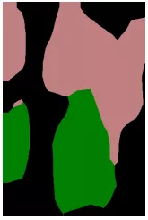

于是，为了解决这个问题，**FCN将不同全局步长下的层之间进行连接**。具体网络结构如下图所示。

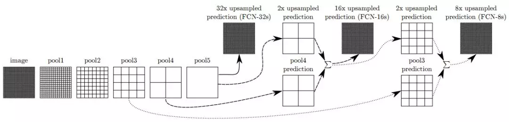

这样一来，随着细节信息的逐渐加入，分割的结果也越来越好。比如下图从左到右分别对应了全局步长32、全局步长16和全局步长8下的结果。最右侧是真值。

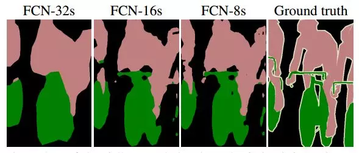

> **3 实验结果**

FCN可以与大部分分类网络有效结合，下表中给出了在PASCAL VOC 2011数据库下，FCN与AlexNet、FCN-VGG16和FCN-GoogLeNet结合的结果。

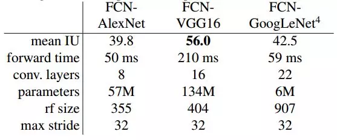

> **4 总结与思考**

尽管FCN意义重大，在当时来讲效果也相当惊人，但是FCN本身仍然有许多局限。比如：

- 没有考虑全局信息
- 无法解决实例分割问题
- 速度远不能达到实时
- 不能够应对诸如3D点云等不定型数据

基于此，各路研究大神们提出了针对不同局限的各种方法。下图给出了部分研究成果与FCN的关系。

补充：

（1）FCN中如何进行反卷积和上采样 

https://blog.csdn.net/nijiayan123/article/details/79416764

https://www.cnblogs.com/abella/p/10304654.html

最大池化和上采样：

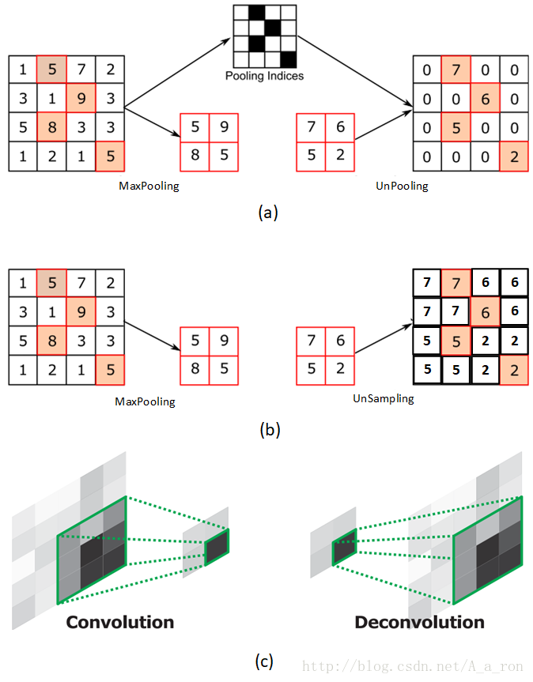

反卷积：

方法一：full卷积，完整的卷积可以使得原来的定义域变大

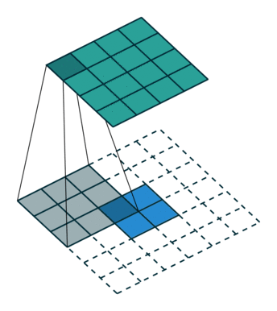

上图中蓝色为原图像，白色为对应卷积所增加的padding，通常全部为0，绿色是卷积后图片。卷积的滑动是从卷积核右下角与图片左上角重叠开始进行卷积，滑动步长为1，卷积核的中心元素对应卷积后图像的像素点。可以看到卷积后的图像是4X4，比原图2X2大了.

方法二、记录pooling index，然后扩大空间，再用卷积填充

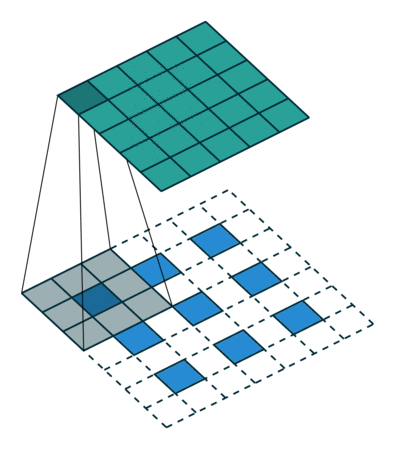

假设原图是3X3，首先使用上采样让图像变成7X7，可以看到图像多了很多空白的像素点。使用一个3X3的卷积核对图像进行滑动步长为1的valid卷积，得到一个5X5的图像，我们知道的是使用上采样扩大图片，使用反卷积填充图像内容，使得图像内容变得丰富

（2）不同步长之间如何连接

直接将全卷积后的结果上采样后得到的结果通常是很粗糙的，将不同池化层的结果进行上采样，然后结合这些结果来优化输出

https://zhuanlan.zhihu.com/p/22976342代码详解

> 本文仅用于自己个人学习如有侵权请告知 公众号：AI算法与图像处理  删除，谢谢！
>
> 参考和来源：有三AI，https://zhuanlan.zhihu.com/p/66050456

