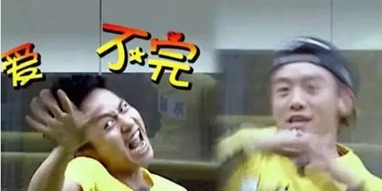
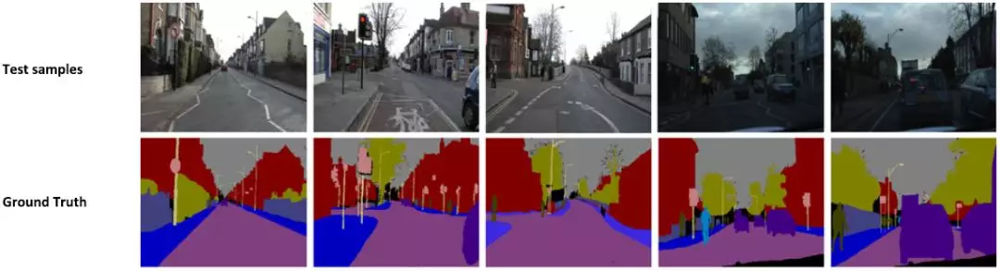
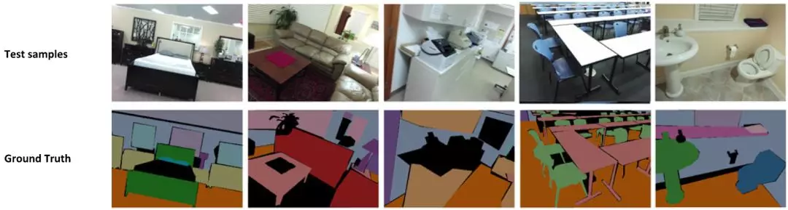
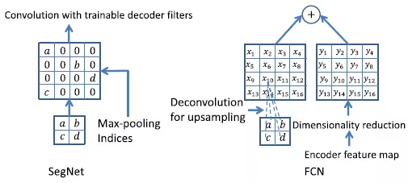
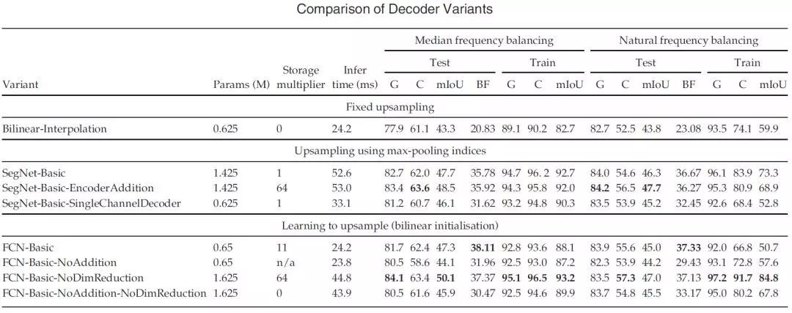
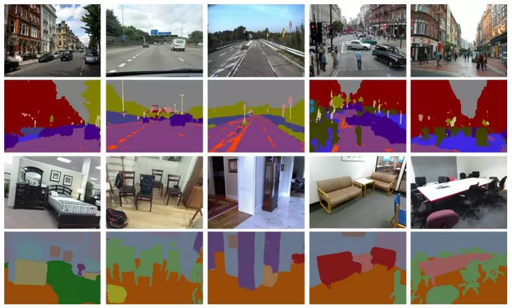

> 本文仅用于自己个人学习如有侵权请告知 公众号：AI算法与图像处理  删除，谢谢！
>
> 参考和来源：有三AI，https://zhuanlan.zhihu.com/p/66050456

> 这是专栏《图像分割模型》的第2篇文章。在这个专栏里，我们将共同探索解决分割问题的主流网络结构和设计思想。
>
> 上篇文章我们学习了分割网络鼻祖FCN，今天我们来看看用解码器踢馆的SegNet。
>
>  作者 | 孙叔桥
>
>  编辑 | 言有三

## 图像分割模型——编解码结构SegNet

代码：https://github.com/alexgkendall/caffe-segnet

https://github.com/tkuanlun350/Tensorflow-SegNet

其他优质文章参考：https://blog.csdn.net/zhuzemin45/article/details/79709874

> **1 编解码结构**

分割任务中的编码器encode与解码器decode就像是玩“你来比划我来猜”的双方：比划的人想把看到的东西用一种方式描述出来，猜的人根据比划的人提供的信息猜出答案。

 其中，“比划的人”叫做**编码器**，“猜的人”就是**解码器**。

具体来说，**编码器的任务是在给定输入图像后，通过神经网络学习得到输入图像的特征图谱；而解码器则在编码器提供特征图后，逐步实现每个像素的类别标注，也就是分割。**

通常，分割任务中的编码器结构比较类似，大多来源于用于分类任务的网络结构，比如VGG。这样做有一个好处，就是可以借用在大数据库下训练得到的分类网络的权重参数，通过迁移学习实现更好的效果。因此，解码器的不同在很大程度上决定了一个基于编解码结构的分割网络的效果。

 SegNet就讨论了这种不同，并在道路和室内两个场景下比较了不同解码器下，各个算法的表现。 

**CamVid数据库：**《Semantic object classes in video: A high-definition ground truth database》

**SUN RGB-D数据库：**《SUN RGB-D: A RGB-D scene understanding benchmark suite》

>  2 SegNet

SegNet的编码器结构与解码器结构是一一对应的，即一个decoder具有与其对应的encoder相同的空间尺寸和通道数。对于基础SegNet结构，二者各有13个卷积层，其中编码器的卷积层就对应了VGG16网络结构中的前13个卷积层。

下图是SegNet的网络结构，其中蓝色代表卷积+Batch Normalization+ReLU，绿色代表max-pooling，红色代表上采样，黄色是Softmax。

 

 SegNet与FCN的对应结构相比，体量要小很多。这主要得益于SegNet中为了权衡计算量而采取的操作：用记录的池化过程的位置信息替代直接的反卷积操作。具体如下图所示。

图中左侧是SegNet使用的解码方式，右侧是FCN对应的解码方式。可以看到，SegNet的做法是先根据位置信息生成稀疏的特征图，再利用后续的卷积计算恢复稠密特征图。而FCN则直接利用反卷积操作求得上采样后的特征图，再将其与编码器特征图相加。

>  3 解码器变体

前文已经提到，编解码结构中，解码器的效果和复杂程度对于整个分割网络的影响是非常大的。这里我们就一起来看一下不同解码器结构和它们的效果。

SegNet中一共尝试了8种不同的解码结构，先上结果：

这些变体共用相同的编码器结构，只是在解码器结构上有所不同。比如，将解码器的结构单纯减少层数，改变解码器最后一层通道数，改变编解码器对应结构之间的连接方式（只连接池化信息、保留特征层内信息或全部保留），改变采样方式等。

除上面几种变体外，论文中还尝试了改变上采样方法，或取消池化和下采样过程，但是这些改变都没有带来更好的结果。

>  4 总结与思考

关于变体的分析，可以总结为以下三点：

- 保留编码器所有特征图所实现的效果最好，在这一点上语义分割边缘轮廓描述度量（BF）体现最为明显。
- 当推理过程的内存受限时，可以使用编码器特征图的压缩形式（比如缩小维度、使用池化信息等），但需要搭配合适的解码器形式（比如SegNet类型的）来提升表现。
- 在给定编码器时，越大的解码器效果越好。

补充：

> 本文仅用于自己个人学习如有侵权请告知 公众号：AI算法与图像处理  删除，谢谢！
>
> 参考和来源：有三AI，https://zhuanlan.zhihu.com/p/66050456