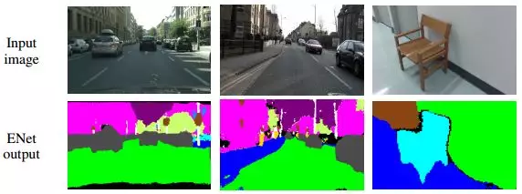
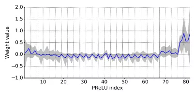
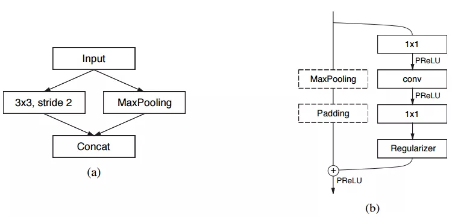
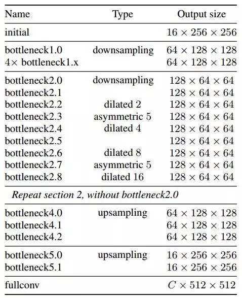
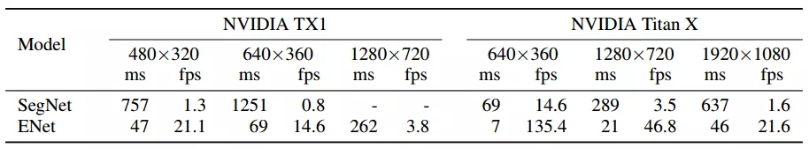
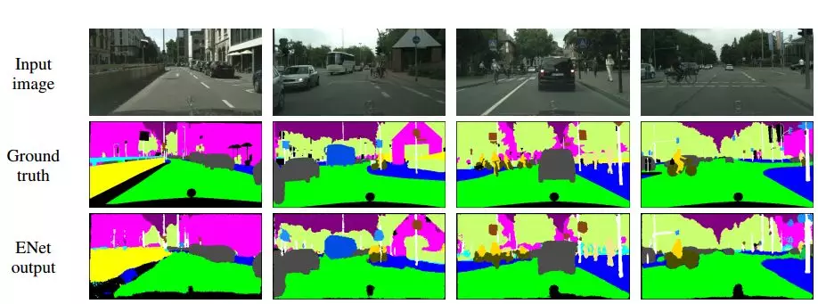
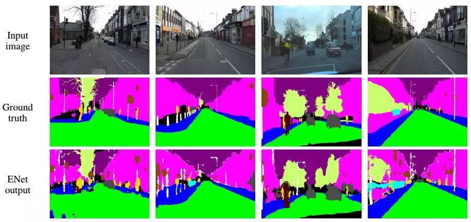
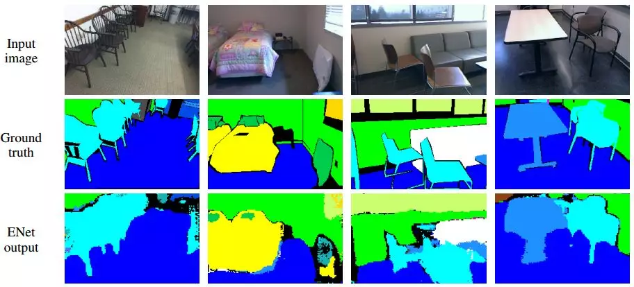

> 本文仅用于自己个人学习如有侵权请告知 公众号：AI算法与图像处理  删除，谢谢！
>
> 参考和来源：有三AI，https://zhuanlan.zhihu.com/p/66050456

> 这是专栏《图像分割模型》的第4篇文章。在这个专栏里，我们将共同探索解决分割问题的主流网络结构和设计思想。
>
> 有了空洞卷积，这篇文章我们通过ENet看看在实际任务中，该怎么用好空洞卷积。
>
>  作者 | 孙叔桥
>
>  编辑 | 言有三

## 图像分割模型——快速道路场景分割—ENet

代码：

https://github.com/e-lab/ENet-training

https://github.com/kwotsin/TensorFlow-ENet

https://github.com/PavlosMelissinos/enet-keras

https://github.com/TimoSaemann/ENet

其他优质文章参考：

> **1 绪论**

虽然深度神经网络在计算机视觉领域的有效性已经是毋容置疑的了，但是大部分神经网络仍然**受限于计算量、存储空间、运算速度**等因素，无法应用于实际的计算机视觉任务。

以图像分割为例，前面提到的SegNet的速度已经相当快了，但是仍然远不能达到实时分割的目的。比如道路场景分割任务，至少需要达到10fps，而SegNet的速度只能实现1fps左右。

无法适应实际需要的网络结构是很受限的，因此，本文我们一起来看一下能够实现实时语义分割的ENet结构，从中找找灵感。

>  **2 实时，该考虑什么**

**这里先上技巧实验的干货总结：**

**(1) 特征图分辨率**

为了减小计算量、增大感受野，许多网络都采用缩小特征图分辨率的结构（比如前面提到的SegNet）。但是，过度缩小特征图分辨率则会造成严重的信息丢失，从而造成分割精度的下降。**因此，要尽可能约束下采样的比率。目前被广泛接受的下降比率不超过1/8。**那么还要继续增大感受野该怎么办呢？没错，就是用到**空洞卷积**了。

**(2) 提前下采样**

直接用原始分辨率的图片作为网络输入的代价是很高的。由于视觉信息中存在大量的冗余，在输入网络之前，可以对输入做一个预处理，也就是**先用一层网络将这些信息浓缩，同时缩小空间尺寸。**实验证明，**这一步的特征图个数不用太多，16与32效果几乎相同。**

**(3) 解码器规模**

前面我们接触到的编解码结构中，解码器与编码器在结构上几乎是完全对等的。这种结构看起来没有问题，但是真的合理吗？其实，**编码器的规模可以大一些，**因为要**用来提取信息；**但是**解码器本质上只是对编码器结果的细节精调，**因此**规模可以减小。**

**(4) 非线性操作**

这一点相信很多人在实验中已经发现了，那就是在某些情况下，ReLU的引入并不会对结果产生有利的影响。相反，**用PReLU替代**反而会更好。

 **(5) 分解卷积层**

考虑到卷积层权重其实有相当大的冗余，可以用nx1和1xn的两个卷积层级联（对称卷积）来替代一个nxn的卷积层来缩小计算量。具体地，用n=5的对称卷积的计算量近似于一个3x3的普通卷积，但是由于引入了非线性，这样的操作还能够增加函数的多样性。

**(6) 空洞卷积**

引入空洞卷积可以减小计算量、增大感受野，同时维护了特征图的分辨率。为了使空洞卷积发挥最大的作用，ENet中穿插地使用了普通卷积、对称卷积和空洞卷积。

>  **3 网络结构**

ENet主要由两种类型的网络结构构成，如下图所示：

其中，图(a)对应的是ENet的初始模块，也就是前文提到的缩小输入图像分辨率，从而去除视觉冗余、减小计算量的部分；图(b)对应的则是重复使用，从而构建网络主体的bottleneck模块。

具体结构如下表所示（输入尺寸512x512）：

其中Type一列说明的是该bottleneck对应的卷积类型，即图(b)中的conv层。

>  **4 实验结果**

ENet在Cityscapes、CamVid和SUN RGB-D三个数据库下进行了测试。下表是与SegNet的运行速度对比：

Cityscapes数据库下的结果：

CamVid下的结果：

SUN RGB-D下的结果：

>  **5 总结

 通过DeepLab和ENet的学习，我们初步了解了图像分割中上下文信息整合方法的第一部分——空洞卷积。

**补充&总结：**

> 本文仅用于自己个人学习如有侵权请告知 公众号：AI算法与图像处理  删除，谢谢！
>
> 参考和来源：有三AI，https://zhuanlan.zhihu.com/p/66050456