> 本文仅用于自己个人学习如有侵权请告知 公众号：AI算法与图像处理  删除，谢谢！
>
> 参考和来源：有三AI，https://zhuanlan.zhihu.com/p/66050456

> 这是专栏《图像分割模型》的第3篇文章。在这个专栏里，我们将共同探索解决分割问题的主流网络结构和设计思想。
>
> 前两篇文章介绍了编解码分割结构，今天具体聊聊解码器中涉及到的空间分辨率恢复问题。
>
>  作者 | 孙叔桥
>
>  编辑 | 言有三

## 图像分割模型——感受野与分辨率的控制术—空洞卷积

代码：

其他优质文章参考：

> **1 绪论**

通过前两篇文章，我们了解到分割任务是一个像素级别的任务，因此需要在输入的空间尺寸下对每个像素都有分割的结果。**换句话说，如果输入的空间尺寸是HxW，那么输出也需要是HxW的。**

然而，为了提高网络性能，许多结构采用了池化或striding操作来增加感受野，同时提升远程信息的获取能力。但是这样的结构也带来了空间分辨率的下降。

比如之前提到的编解码结构中的编码器。

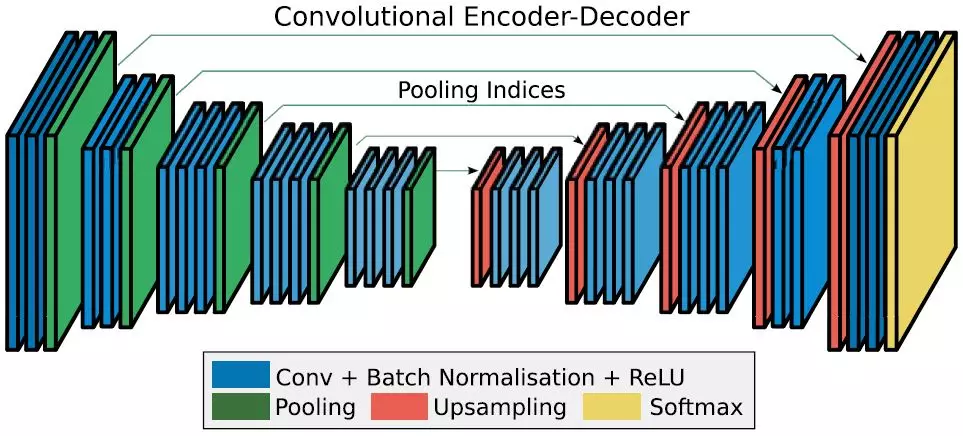

在空洞卷积提出以前，大部分的空间尺寸恢复工作都是由上采样或反卷积实现的。前者通常是通过线性或双线性变换进行插值，虽然计算量小，但是效果有时不能满足要求；后者则是通过卷积实现，虽然精度高，但是参数计算量增加了。

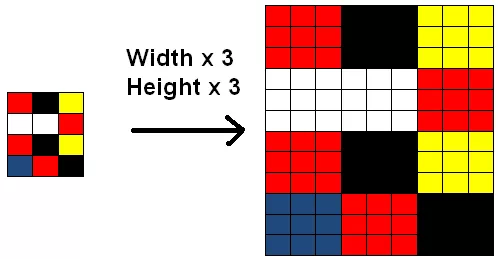

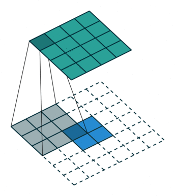

基于此，DeepLab就提出了“空洞卷积”（atrous convolution）的概念。 

>  **2 空洞卷积**

**一句话概括空洞卷积：调整感受野（多尺度信息）的同时控制分辨率的神器。**

**(1) 控制感受野**

下图是空洞卷积结构的示意图，从左到右比率（rate）分别为1、6和24，比率可以粗暴理解为卷积核内相邻两个权重之间的距离。从图中可以看出，当比率为1的时候，空洞卷积退化为常见的卷积。

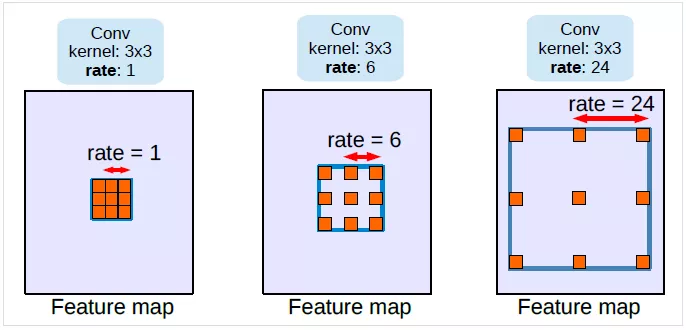

很明显，应用空洞卷积后，卷积核中心像素的感受野（也就是一个卷积核能看见的区域）增大了，但是在步长为1的情况下，特征图的空间分辨率却可以保持不变。

**(2) 控制分辨率**

除了维持空间分辨率，空洞卷积也可以像标准卷积一样通过设置输出步长（output_stride）实现输出特征图分辨率的控制。

 

>  **3 网络结构**

**(1) 网络结构介绍**

在目标检测、图像分割等计算机视觉任务中，图片中可能出现如下图情况中的不同大小的目标。为了应对一个目标在不同尺度下的识别或分割造成的困难，研究者们想出了许多方法获取同一位置上不同尺度的上下文信息，从而保证算法对于尺度变化具有一定鲁棒性。

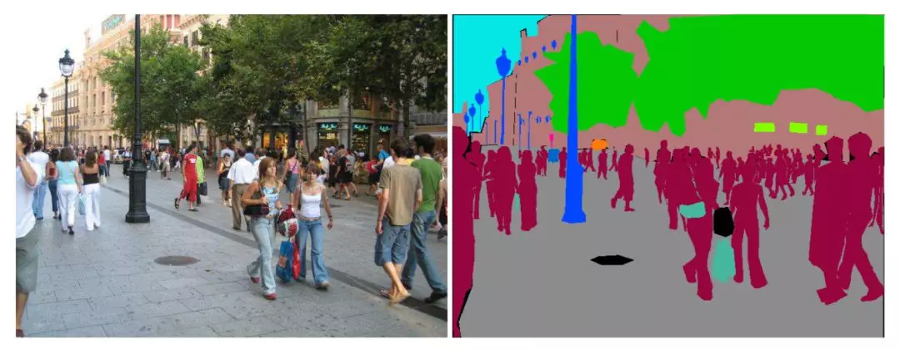

在图像分割领域中，主要存在下面四种网络结构能够实现多尺度上下文的获取。从左到右分别是金字塔结构、编解码结构、空洞卷积结构和空间金字塔池化结构。

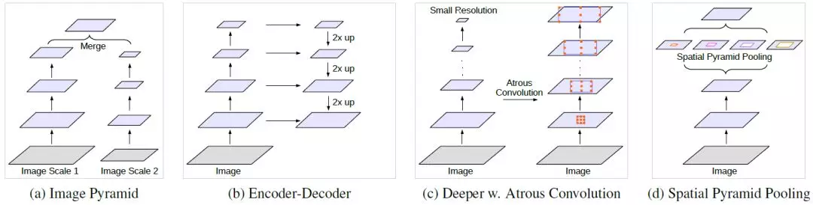

前两种结构是通过输出步长的设置，逐步缩小输出特征图的分辨率，从而使得每层特征上所对应的感受野的尺寸变化；第三种结构是通过直接改变每个卷积核的可见区域实现感受野变化；最后一个结构是通过对特征层进行不同尺度的池化，实现感受野的遍历。

**(2) 空洞卷积结构1**

下图(b)是基于上面第三种结构的空洞卷积分割网络结构图，(a)是对应的第三种结构的网络结构图。

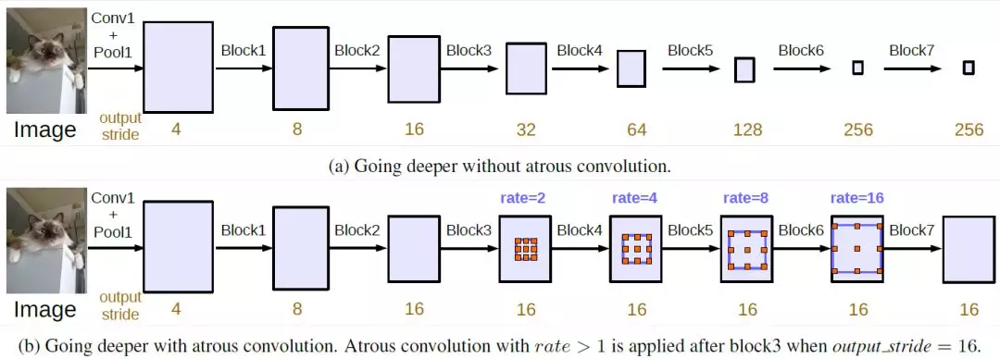

可以看到从block4到block7，通过应用不同比率的空洞卷积，该网络结构实现了在维持空间分辨率的前提下的感受野（尺度）变化。

**(3) 空洞卷积结构2**

下图是基于最后一种结构的空洞卷积网络结构，也称为ASPP（Atrous Spatial Pyramid Pooling），也是前两个DeepLab版本中所使用的网络结构。

这种结构将上个结构的串联空洞卷积变成了并联的空洞卷积运算，基于同一级特征结构提取不同尺度下的卷积结果。

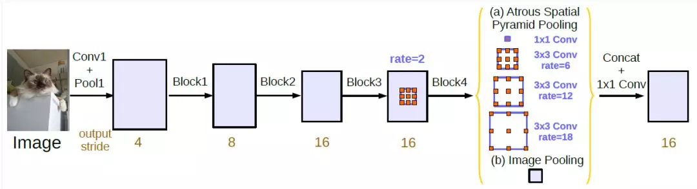

>  **4 实验及分析**

**(1) 卷积核的有效权重**

通过前面的了解，我们可以发现一个问题。那就是，当空洞卷积的区域与特征图实际空间尺寸相近的时候，实际有效的卷积核权重是非常有限的。

比如，对一个65x65的特征图应用不同比率的3x3滤波器，我们可以得到下图的结果。

可见，在极端条件下，当空洞卷积的比率接近特征图空间尺寸时，一个3x3的卷积核就退化成了1x1的卷积核。

为了克服这个问题，DeepLabv3中采用的做法是对最后一层特征图应用全局池化（global pooling），再将其送入一个1x1的卷积层中，最后，通过双线性上采样实现希望的空间分辨率。

**(2) 实验总结**

DeepLabv3给出了诸多条件下的剥离实验，首先给出整体结论：

- 输出步长为8时效果比更大的步长要好；
- 基于ResNet-101的结构比基于ResNet-50的要好；
- 用变化的比率比1:1:1的比率要好；
- 加上多尺度输入和左右翻折数据效果更好；
- 用MS COCO下预训练的模型效果更好。

具体结果看下面表格：

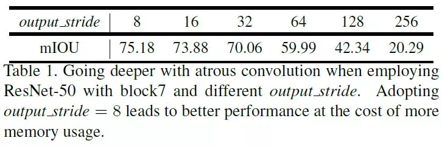

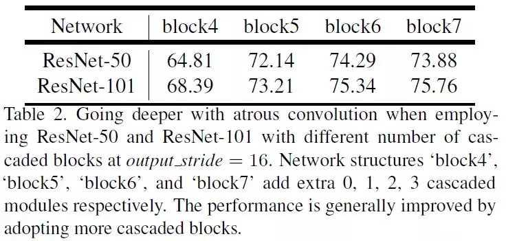

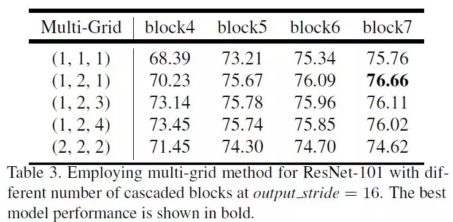

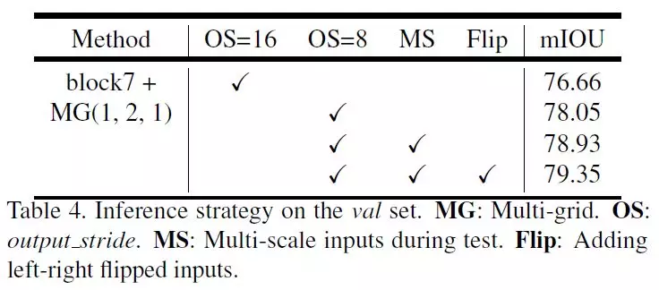

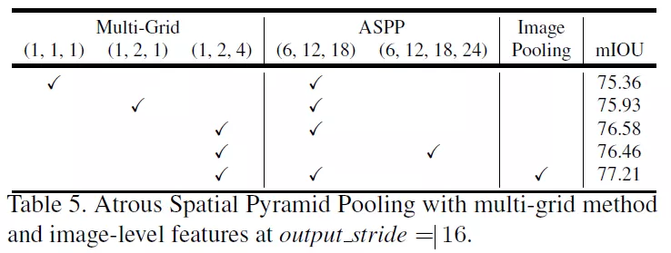

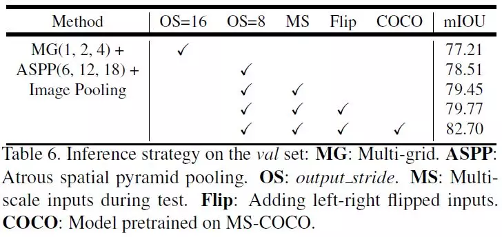

> 表格均来源于DeepLabv3论文：
>
> 《Rethinking Atrous Convolution for Semantic Image Segmentation》

>  **5 更多结果**

 **经过DeepLab和空洞卷积的学习，我们一起从之前的编解码结构共同迈入了第二大分割问题的处理方法：上下文信息整合。从这篇文章开始，我们将一起探索多种不同的上下文信息整合方法。**

**补充&总结：**

（1）感受野是指什么？

感受野（receptive field，RF）指的https://zhuanlan.zhihu.com/p/59899622是一个特定的CNN特征（特征图上的某个点）在输入空间所受影响的区域。一个感受野可以用中心位置(center location)和大小(size)来表征。

（2）多尺度的理解

首先理解尺度空间，我们的尺度空间是分辨率是相同的，然后使用不同的高斯核（传统反向）；从直观上说，这多尺度是模仿人类的视网膜的特征，不同的距离看的物体模糊是不同的，离我们越远越模糊，从而我们看到全局信息；离我们越近的话，看的越清楚，看的是局部信息。从CNN网络来看我们使用不同的conv层，（缩放到统一尺寸下面）。越深的卷积层提取出的特征图越抽象，所以这就相当于是一种不同尺度下的特征（分辨率一致）。

（3）如何理解空洞卷积控制分辨率的说法？

如果使用降采样，虽然增大了感受野，但是空间分辨率会降低。

感受野大可以检测分割大目标，分辨率高可以精确定位目标。

**空洞卷积的不足之处：**

空洞卷积是存在理论问题的，论文中称为gridding，其实就是网格效应/棋盘问题。因为空洞卷积得到的某一层的结果中，邻近的像素是从相互独立的子集中卷积得到的，相互之间缺少依赖。

- **局部信息丢失**：由于空洞卷积的计算方式类似于棋盘格式，某一层得到的卷积结果，来自上一层的独立的集合，没有相互依赖，因此该层的卷积结果之间没有相关性，即局部信息丢失。
- **远距离获取的信息没有相关性**：由于空洞卷积稀疏的采样输入信号，使得远距离卷积得到的信息之间没有相关性，影响分类结果。

参考：https://www.zhihu.com/question/54149221/answer/323880412

参考：https://zhuanlan.zhihu.com/p/59899622

参考：http://www.pianshen.com/article/4552301946/

> 本文仅用于自己个人学习如有侵权请告知 公众号：AI算法与图像处理  删除，谢谢！
>
> 参考和来源：有三AI，https://zhuanlan.zhihu.com/p/66050456