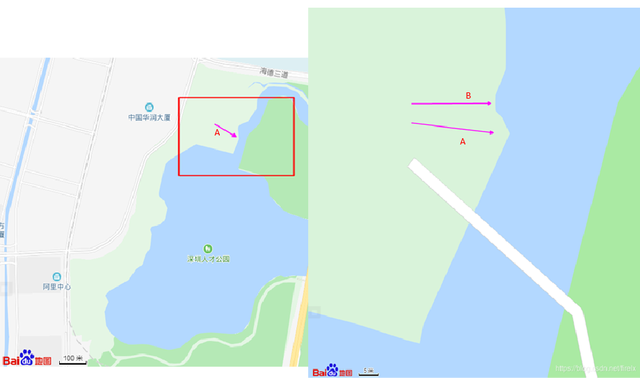
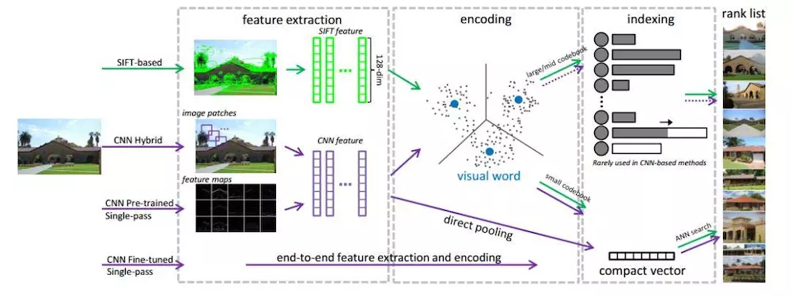
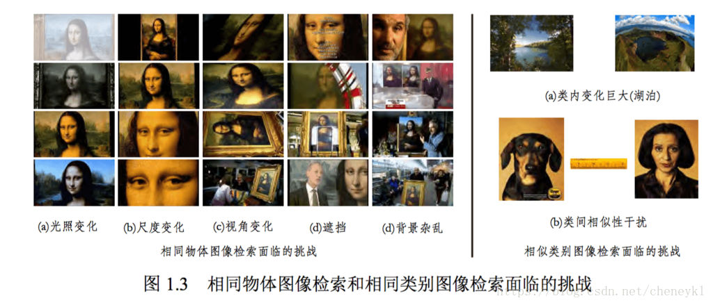
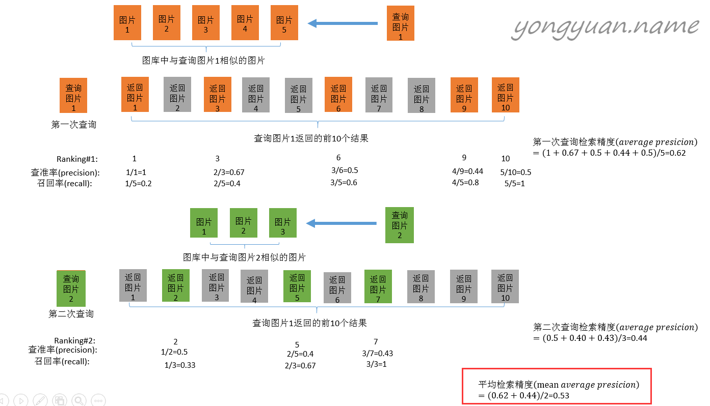

## 图像检索

图像检索，简单的说，便是从图片检索数据库中检索出满足条件的图片，图像检索技术的研究根据描述图像内容方式的不同可以分为两类：

一类是基于文本的图像检索技术，Text-based Image Retrieval，简称TBIR，利用文本描述的方式描述图像的特征进行分析和检索的图像检索技术；

一类为基于内容的图像检索技术，Content-based Image Retrieval，简称CBIR，利用图像特征如图像的颜色、纹理、布局等进行分析和检索的图像检索技术。

## 图像检索技术的步骤

图像检索技术主要包含几个步骤，分别为：**输入图片、特征提取、度量学习、重排序**。

特征提取：即将图片数据进行降维，提取数据的判别性信息，一般将一张图片降维为一个向量；

度量学习：一般利用度量函数，计算图片特征之间的距离，作为loss，训练特征提取网络，使得相似图片提取的特征相似，不同类的图片提取的特征差异性较大。

重排序：利用数据间的流形关系，对度量结果进行重新排序，从而得到更好的检索结果。

## 图像检索发展

### SIFT算子

2003-2012，提取特征的方法主要基于SIFT的特征，由于SIFT特征在图像尺寸、方向变化问题中表现优异

Lowe将sift算法分为四个步骤：

（1）尺度空间极值检测： 这一步我们将对图像进行一些特定的处理，处理之后，通过微分函数识别不会因为光照、尺度变化不变的兴趣点

（2）关键点定位： 在第一步的基础上，我们需要通过拟合判别，来丢掉一些我们不稳定的兴趣点

（3）方向确定： 在第二步的基础上，我们为每一个点分配一个或者多个方向

（4） 描述子： 在每一个关键点的邻域内，在选定的尺度上测量图像梯度这些梯度经过处理之后形成描述子

#### 尺寸空间

基本思想：在图像信息处理模型中引入一个被视为尺度的参数，通过连续变化尺度参数获得多尺度下的尺度空间表示序列，对这些序列进行尺度空间主轮廓的提取尺度空间中各尺度图像的**模糊程度逐渐变大**，能够模拟人在距离目标**由近到远**时目标在视网膜上的形成过程。

尺寸空间认为，例如从上图的右边到左边的过程，实际上在平滑图片，对于局部的细节特征进行了一定程度的模糊。构建不同的尺寸空间，可以获得不同尺度下的表达。

[参考资料](https://www.cnblogs.com/shine-lee/p/10037463.html)

#### 图像金字塔

尺度空间中，不同尺度下观测窗口的像素尺寸是不同，还有另外一种情况，**保持观测窗口大小不变，让图像尺寸发生变化**。

构建**图像金字塔**，是为了获得图像在不同尺寸（不同分辨率）下的表达，通过不断重复 **平滑+下采样** 的过程。**图像金字塔，是在保持观测窗口不变的情况下，获得输入图像在不同尺寸（分辨率）下的表达，在不同尺寸上提取到的特征在整体上做到了尺寸（分辨率）无关。**

所以，从上面的表述中，说明，尺寸空间和图像金字塔实际上存在这某种关联。

但还是有一些差别，

**图像金字塔**是结合降采样操作和平滑操作的一种图像表示方式。它的一个很大的好处是，自下而上每一层的像素数都不断减少，这会大大减少计算量；而缺点是自下而上金字塔的量化变得越来越粗糙，而且速度很快。

**尺度空间**表示法是多尺度表示的另外一种有效方法，它的尺度参数是连续的，并且所有尺度上空间采样点个数是相同的

[参考资料](https://www.cnblogs.com/ct1104/p/4480928.html)

除了SIFT以外其他的算子，HOG，LBP，Haar, [BOW,bag of words](https://blog.csdn.net/tiandijun/article/details/51143765)

SITF特征与CNN的图像检索流程

[来源：图像检索十年综述](https://www.jianshu.com/p/ebf6fbdb44e9)

### 局部敏感哈希（Locality-Sensitive Hashing，LSH）

用于海量高维数据的近似最近邻快速查找技术——局部敏感哈希

LSH**的基本思想**

将原始数据空间中的两个相邻数据点通过相同的映射或投影变换（projection）后，这两个数据点在新的数据空间中仍然相邻的概率很大，而不相邻的数据点被映射到同一个桶的概率很小。也就是说，如果我们对原始数据进行一些hash映射后，我们希望原先相邻的两个数据能够被hash到相同的桶内，具有相同的桶号。对原始数据集合中所有的数据都进行hash映射后，我们就得到了一个hash table，这些原始数据集被分散到了hash table的桶内，每个桶会落入一些原始数据，属于同一个桶内的数据就有很大可能是相邻的，当然也存在不相邻的数据被hash到了同一个桶内。

[更详细的内容：LSH](https://www.cnblogs.com/wt869054461/p/8148940.html)

### 基于深度学习的图像检索

（1）相同物体图像检索，指对查询图像中的某一物体，从图像库中找出包含有该物体的图像。

（2）相似类别图像检索，从图像库中查找出那些与给定查询图像属于同一类别的图像。

[来源：浅谈图像检索](https://blog.csdn.net/cheneykl/article/details/80292263)

提及到使用**[深度学习提取图像特征](https://baijiahao.baidu.com/s?id=1606109643899679187&wfr=spider&for=pc)**，业界一般认为现有的图像模型中，前面的卷积层负责提取相关特征，最后的全连接层或者 globel pooling 负责分类，因此一般的做法是直接取**前几层卷积的输出**，然后再计算相似度。

**存在的问题**：

（1）数据精度问题，特征输出多为浮点数且维度高，导致耗费大量空间；

（2）维度灾难（维数灾难），由于维度高，采用欧式距离计算相似度时，可能会触发维度灾难，导致方法失效。

**解决方法**

（1）使用Triplet函数构造一个能够学习如何计算相似度的神经网络。[FaceNet](https://blog.csdn.net/u013044310/article/details/79556099)

（2）将浮点数离散为二值型数据，就是一串0和1的哈希。

（3）不采用分类网络的中间层作为特征，而是直接采取一个神经网络进行哈希函数的学习，并用正则方法将输出的特征的序列约束到一定范围内。

## 论文：

[大规模图像检索深度特征：Large-Scale Image Retrieval with Attentive Deep Local Features](https://blog.csdn.net/wangxinsheng0901/article/details/81906696)

### 图像检索的指标

[信息检索中的mAP](https://yongyuan.name/blog/evaluation-of-information-retrieval.html)

AP指的是不同召回率下的正确率的平均值

mAP指的是多次查询结果的平均值

CNN中1x1的卷积核的作用

（1）实现跨通道的交互和信息整合

（2）进行卷积核通道数的降维和升维

图片的特征提取主要是对图像的颜色、纹理、形状、灰度等信息进行提取，常用的有基于颜色的直方图、相关图、颜色矩的检索方法，基于统计法、频谱法、模型法等纹理特征的图像检索方法，基于边缘、区域的形状检索方法。而这些经典方法均以人为设计的特征为基础，设计方法的好坏直接影响图像检索的效果。深度学习是机器学习研究的新领域，具有利用大数据自动学习数据特征的优势而引起人们的关注，从而解决了人为因素所带来的不确定性。

