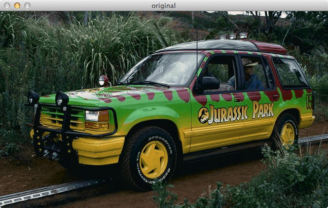
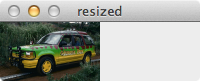
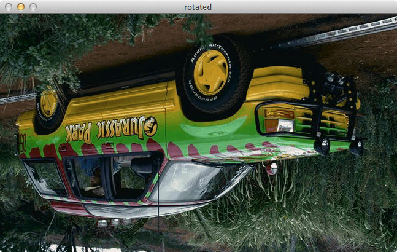
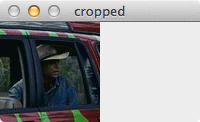
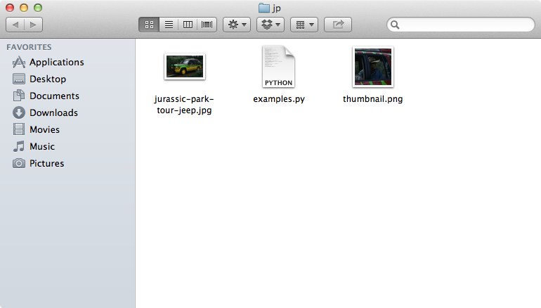

python和opencv中的基本图像操作：调整大小（缩放）、旋转和裁剪


导入图片并显示在屏幕上

``` python
# 导入需要的包f
import cv2

# 导入图片并显示
image = cv2.imread("jurassic-park-tour-jeep.jpg")
cv2.imshow("original", image)
cv2.waitKey(0)
```

在电脑上执行上面的代码得到以下的结果：



正如我们所看到的，这个图片现在已经显示出来了。接下来讲解一下这些代码：

- Line 2：第一行只是告诉python解释器导入OpenCV的包
- Line 5：从磁盘中导入图片。imread函数返回一个NumPy数组，表示图像本身。
- Line 6和7：调用函数将图片显示在屏幕上。第一个参数是一个字符串，用于指定是窗口的名称。第二个参数是我们从磁盘加载的图片的引用。最后，调用waitKey会暂停脚本的执行直到我们按下键盘的键。使用参数“0”表示任何按键都将取消暂停执行。

仅仅导入和显示图片并不是非常的有趣。现在让我们调整图片的大小，使其更小。我们可以通过使用图片的shape属性来查看图片的尺寸，因此图片毕竟是一个NumPy数组。

```
print(image.shape)
```

当执行上面的代码，我们看我们的终端输出结果是（388, 647, 3）。这意味着图片有388行，647列，3个通道（RGB成分）。当我们写矩阵的时候，这通常将它们写成这样子的格式（行x列）这在NumPy中指定矩阵的大小是同样的方式。

然而，当处理图片时这将变的有点混乱，因为我们通常说的图片尺寸是指图片的宽和高。看这个矩阵的形状，我们可能会认为我们的图片是宽为388个像素，高为647个像素。然而，这是不正确的。我们的图片实际上宽647个像素，高为388个像素，这意味着高度是形状的第一个位置，宽度是第二个位置，如果你是刚开始使用OpenCV，那么这一点可能会有点困惑，需要记住这点。

既然我们知道我们的图像的宽是647个像素，那么让我们调整它的大小并使其为100个像素宽

```python
#　我们需要记住横纵比，这样子才不会使得图片看起来是歪斜或扭曲，因此我们计算原图和变换后的图片的比例
r = 100.0/image.shape[1]
dim = (100, int(image.shape[0]*r))

# 采用图片的实际比例并显示图片
resized = cv2.resize(image, dim, interpolation = cv2.INTER_AREA)
cv2.imshow("resized", resized)
cv2.waitKey(0)
```

执行上面的代码，可以看到新的调整后的图片仅仅只有100个像素宽



让我们分解代码并检查一下：

- Line 2和Line 3：我们必须记住图片的横纵比，即图片的宽和高的比例关系。在这种情况下，我们将图片大小调整为100个像素宽度，因此，我们需要计算新图到旧图的比例r。然后，我们用100个像素宽度和r × 旧图片的高度来构造新的图片的尺寸。这样子做就可以保持图片的横纵比。
- Line 6-8：图片大小的调整是在这里进行操作的。第一个参数是需要调整大小的原始图片，第二个参数是计算得到的新图片尺寸，第三个参数告诉我们调整大小时采用的算法。暂时别担心。最后，我们显示图片并等待按钮。

调整图片的大小也不错。现在，我们将这两吉普车翻过来：

```python
# 获取图片的尺寸和图片中心
(h, w) = image.shape[:2]
center = (w/2, h/2)

# 180°旋转图片
M = cv2.getRotationMatrix2D(center, 180, 1.0)
rotated = cv2.warpAffine(image, M, (w, h))
cv2.imshow("rotated", rotated)
cv2.waitKey(0)
```

所以现在这辆吉普车变成什么样？你可以猜一下，它已经翻过来了



让我们一部分一部分的去研究代码：

- Line 2：为了方便起见，我们获取图片的宽和高，并将它们存储在各自的变量中。
- Line 3：计算图片的中心——我们只是简单将宽度和高度除以2
- Line 6：计算用于图片选择的矩阵。第一个参数是我们计算得到的图片中心。如果你想绕着任意点旋转图片，可以在这里指定这个点。第二个参数是我们的旋转角度，第三个参数是比例因子——在这个例子中，1.0，因为我们希望保持图片的原始比例。如果我们想使图片的大小减半，可以设置为0.5，类似的，如果我们想把图片的大小变大1倍，可以设置为2.0.
- Line7：设定图片，旋转矩阵和输出尺寸执行旋转操作
- Lines 9-10：显示旋转图片

让我们继续裁剪图片并获取特写镜头：

```
#　使用数组切片裁剪图片——NumPy数组
cropped = image(70:170,440:540)
cv2.imshow("cropped", cropped)
cv2.waitKey(0)
```



在python和OpenCV中，裁剪操作需要我们做的就是分割数组。

最后一个例子，保存裁剪后的图片到磁盘中，保存为PNG格式

```
# 以PNG格式将裁剪后的图片写入磁盘
cv2.imwrite("thumbnail.png", cropped)
```

我们需要做的就是提供路径去保存文件（第一个参数），然后图片将保存（第二个参数）。

