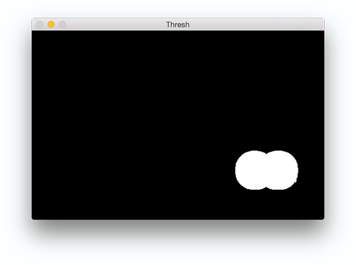
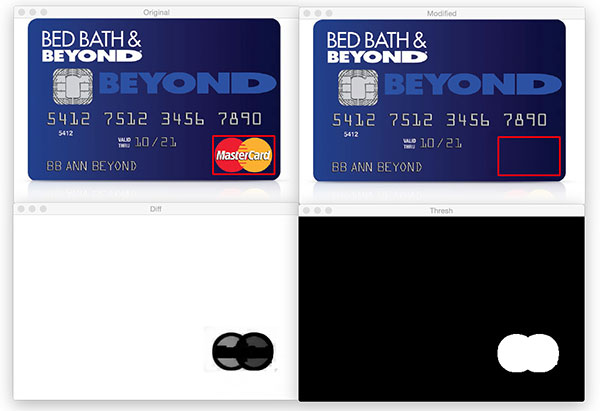
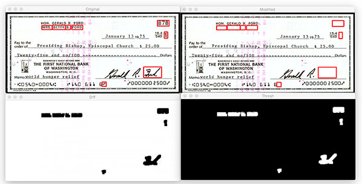

利用OpenCV和python对比图像的差异


今天，我们将使用扩展ssim（结构相似性索引）方法，以便使用OpenCV和python可视化图像之间的差异。具体来说，我们将在两个输入图片的不同处绘制边界框。

为了计算两张图片的不同，我们将使用结构相似性索引（由wang等人首次提出）。在他们的2004年论文中，[图像质量评估：从可视化误差到结构相似性](https://ece.uwaterloo.ca/~z70wang/publications/ssim.pdf)。该方法已经在scikit-image库中应用于图像处理。

要去学习的技巧是我们如何去准确确定图片不同点的坐标位置（x，y）。

要实现这一点，首先我们要确定系统已经安装好python、OpenCV、scikit-image和imutils。

你可以使用下面的OpenCV安装教程学习如何在系统上配置和安装python和OpenCV。https://www.pyimagesearch.com/opencv-tutorials-resources-guides/

如果你还没安装或更新scikit-image包，你可以使用下面的操作：

```python
pip3 install --upgrade scikit-image
```

同样的，如果你还为安装或更新imutils，你可以使用下面的操作：

```python
pip3 install --upgrade imutils
```

现在我们的系统已经准备好了，可以继续往下操作了。

**计算图片的不同**

你能分辨出下面这两幅图片的区别吗？


如果你利用一点时间研究这两种信用卡，你会发现左边的图片上是有一个logo的，但是右边的图片已经用ps消除了。

你可能会马上注意到这个差异，或者说花费一点时间。不管怎样，这都说明了比较图片的差异是一个重要的方面——有时图片的差异是微小的——这将导致肉眼难以立刻发现这些差异（文章的后面会有一个这样子的例子）。

**为什么计算图片的差异如此重要？**

一个例子是网络钓鱼。攻击者可以轻而易举地操纵图片，以欺骗那些不验证url的用户，让他们认为自己正在登录银行网络，但后面却发现这是一个骗局。

在网站上存在一个数据库对比logo和已知用户界面（UI）元素帮助减少钓鱼网站的攻击。（这要归功于Chris Cleveland的论文——通过监视来检测钓鱼网站，作为一个例子应用于计算机视觉来阻止钓鱼网站）

http://www1.icsi.berkeley.edu/~sadia/papers/phishzoo-icsc_final.pdf

开发一个网络钓鱼检测系统显然比简单的图片差异对比要复杂得多，但是我们仍然可以应用这些技术来确定一个给定的图片是否被处理过。

现在，让我们计算两张图片的差异，并使用OpenCV、scikit-Image和python可视化这些差异。

打开一个新文件并命名为image_diff.py，并插入下面的代码：

```python
# 导入必要的包
from skimage.measure import compare_ssim
import argparse
import imutils
import cv2

# 构造解析参数
ap = argparse.ArgumentParser()
ap.add_argument("-f","--first",required=True,
               help="first input image")
ap.add_argument("-s","second",required=True,
               help="second")
args = vars(ap.parse_args())
```

第2-5行为导入的必要包。我们将使用compare_ssim（scikit0-image）、argparse、imutils和cv2

我们建立两个命令行参数--first和--second，这是我们想要比较的两张图片的路径（第8-13行）

接下来，我们将从磁盘中导入图片并将他们转换为灰度图：

```python
# 导入图片
imageA = cv2.imread(args["--first"])
imageB = cv2.imread(args["--second"])

# 把图片转换为灰度图
grayA = cv2.cvtColor(imageA, cv2.COLOR_BGR2GRAY)
grayB = cv2.cvtColor(imageB, cv2.COLOR_BGR2GRAY)
```

我们导入第一张和第二张图片，并将它们各自存储为imageA和imageB。（第2-3行）


然后我们将其转为灰度图（第6-7行）


接下来，开始计算两会在那个图片之间的结构相似性索引（SSIM）

```python
# 计算两张图片的结构相似性索引
# 确保差分图片
(score, diff) = compare_ssim(grayA, grayB, full=True)
diff = (diff*255).astype("uint8")
print("SSIM:{}".format(score))
```

在第3行中使用scikit-image中的compare_ssim函数，我们计算得到一个score和差分图片diff

score代表两张输入图片的**结构相似性索引**。

该值的范围在[-1, 1]，其中值为1时为“完美匹配”。

差分图片包含了我们希望可视化的两张输入图片的实际图片不同点。差分图片当前表示为范围[0, 1]的浮点数，因此在我们继续用OpenCV进处理之前，首先要将数组转换为范围[0, 256]的8位无符号整数。

现在，找到这些轮廓，这样我们可以在被标识为“不同”的区域画出矩形。

```python
#　阈值分割差分图像，然后查找轮廓以获得两个输入图片的不同区域
thresh = cv2.threshold(diff, 0, 255,
                      cv2.THRESH_BINARY_INV | cv2.THRESH_OTSU)[1]
cnts = cv2.findContours(thresh.copy(), cv2.RETR_EXTERNAL, 
                       cv2.CHAIN_APPROX_SIMPLE)
cnts = imutils.grab_contours(cnts)
```


在第2-3行中，我们使用cv2.THRESH_BINARY_INV  和 cv2.THRESH_OTSU来阈值处理我们的差分图片——这两个设置使用竖线或符号 “|” 来同时应用。有关OTSU双峰阈值设置的详细信息可以参考：https://docs.opencv.org/trunk/d7/d4d/tutorial_py_thresholding.html

中文版的：cv2.threshold参数详细说明如下：https://blog.csdn.net/sinat_21258931/article/details/61418681

接下来，第4-6行为找阈值的轮廓。第6行中的三元运算符只处理不同版本的OpenCV中的cv2.findcontours返回的特征差异。

下图清楚地显示了被处理过的图片的ROI区域



现在我们已经将轮廓存储在一个列表中，然后在沿着每张图片的不同区域画出矩形。

```python
# 遍历轮廓
for c in cnts:
	# 计算轮廓的边界框，然后在两张输入图片中代表图片不同点的区域绘制边界框
	(x, y, w, h) = cv2.boundingRect(c)
	cv2.rectangle(imageA, (x, y), (x + w, y + h), (0, 0, 255), 2)
	cv2.rectangle(imageB, (x, y), (x + w, y + h), (0, 0, 255), 2)
 
# 显示输出图片
cv2.imshow("Original", imageA)
cv2.imshow("Modified", imageB)
cv2.imshow("Diff", diff)
cv2.imshow("Thresh", thresh)
cv2.waitKey(0)
```

第2行，我们遍历所有的轮廓，cnts。首先，我们使用cv2.boundingRect计算轮廓周围的边界框。我们将相关的（x，y）坐标存储为x和y，此外将矩形的宽和高分别用w和h存储。

然后，我们使用这些值利用函数cv2.rectangle在每个图片上绘制一个红色的矩形。

最后，我们显示对比图片的结果，包含将不同处框选出来的和阈值图片。

我们调用cv2.waitKey函数，让程序等待一个按键输入。

接下来让我们运行代码，并可视化更多不同的图片。

**可视化图片的不同处**

打开终端，并输入下面的命令：

```
python3 image_diff.py --first images/original_02.png --second images/modified_02.png
```

如下图所示，安全芯片和账户持有者的姓名都被删除。


再尝试另一个例子，一张支票。

```python
python3 image_diff.py --first images/original_03.png --second images/modified_03.png
```



注意到这些地方发生了改变：

- 名字被删除
- 支票编号被删除
- 日期旁边的符号被删除
- 最后的名字被删除

肉眼通常在一个复制的图片中找到所有的不同点。幸运的是，我们现在可以通过python、OpenCV和scikit-image轻松的计算这些不同点和可视化结果。

**总结**

今天的文章，我们学习了如何使用OpenCV、python和scikit-image的结构相似性所有（SSIM）来计算图片的不通电。基于图片的不同点，我们也学习了如何标记和可视化两张图片中的不同区域。

更多关于SSIM的内容，可以参考https://www.pyimagesearch.com/2014/09/15/python-compare-two-images/和scikit-image的文档https://scikit-image.org/docs/dev/api/skimage.measure.html#skimage.measure.compare_ssim

https://www.pyimagesearch.com/2017/06/19/image-difference-with-opencv-and-python/