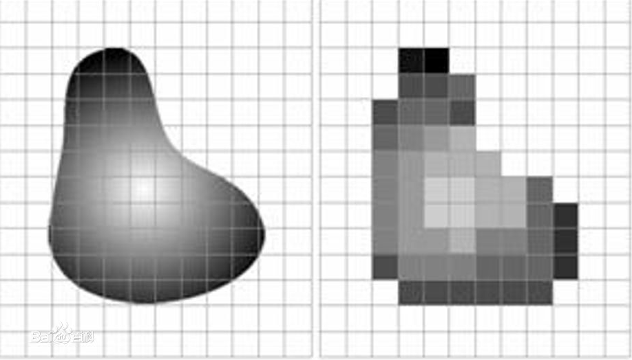
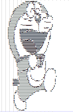

用这种方式打开超级流量明星，写完，我就跑路了

什么是数字图像

数字图像实际上 是二维图像用有限数字数值像素的表示。每个像素具有整数行和列位置坐标，同时每个像素都具有整数灰度值或颜色值。

【看图】



我们今天要做一个有趣的事情

数字图像是用有限的像素点来表示，那么如果将像素点变成其他东西，会是什么样子的呢？

做个这个事情，一方面是好玩，另一方面更有助于理解数字图像


例如我们将像素点变成字符

那么会是什么样子，实际上相当于在每个像素点的位置用字符代替，如同是这个“小格子”原本是填充一种颜色或灰度进去，现在变成了一个字符。

首先看一下效果。

【图——>text】




原理：

（1）读入图片并转化为灰度图

（2）根据“字符”的顺序和灰度值大小进行对应的替换

（3）打印并输出字符图

关键步骤详解：

根据“字符”的顺序和灰度值大小进行对应的替换

（a）根据字符的个数，对灰度值进行划分。（灰度值256/字符个数）

（b）依据灰度值，返回应该传递的字符是哪个

```
unit = (256.0 + 1)/length  # 计算灰度区间对于的字符，例如灰度值1-4，对应 $ 
return ascii_char[int(gray/unit)] # 根据 灰度值 大小计算应该 返回的 字符
```

完整代码链接：


gif图原理与上面的相似

主要差别：

（1）将gif动态图拆成一帧一帧的图片，然后进行类似的操作

这里是在一张空白的图片上打印根据灰度值的区间填充各种所对应的字符。

（2）将上述操作后的图片重新拼成一个gif动态图即可


备注：转为字符图可以对其字符填充的密度进行调整，即代码中的i，j的大小，i，j越小对应的填充密度越大

cv2.putText函数的功能，在图片中添加文字

参数详解：cv2.putText(img, str(i), (123,456)), font, 2, (0,255,0), 3)

各参数依次是：图片，添加的文字，左上角坐标，字体，字体大小，颜色，字体粗细

 https://blog.csdn.net/weixin_42039090/article/details/80679935


将这些像素用字符来代替，

用python将图片转为字符图

https://blog.csdn.net/qq_20464153/article/details/79777823

用python把gif动态图片转化为彩色字符图

https://jingyan.baidu.com/article/d2b1d102dcde665c7e37d489.html

用python视频转化为字符视频

https://blog.csdn.net/mp624183768/article/details/81161260

