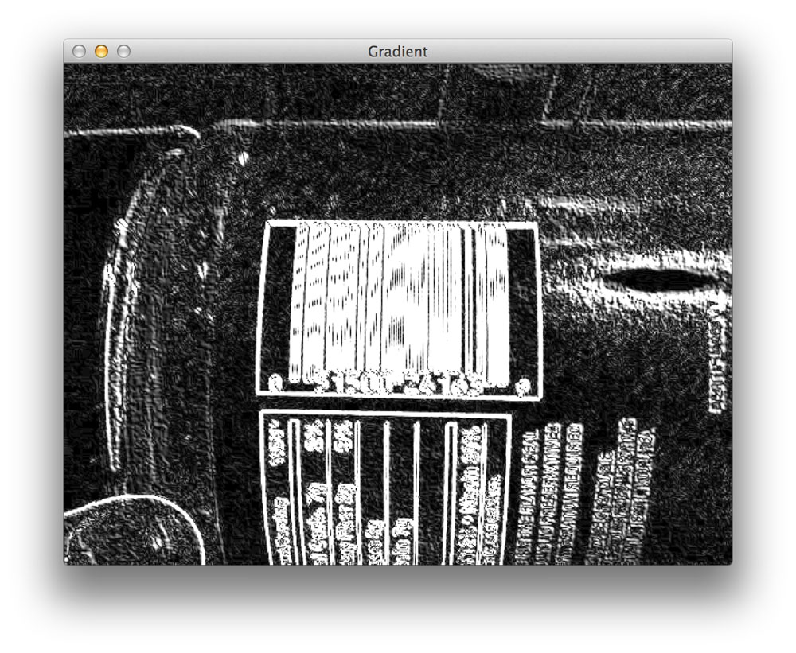
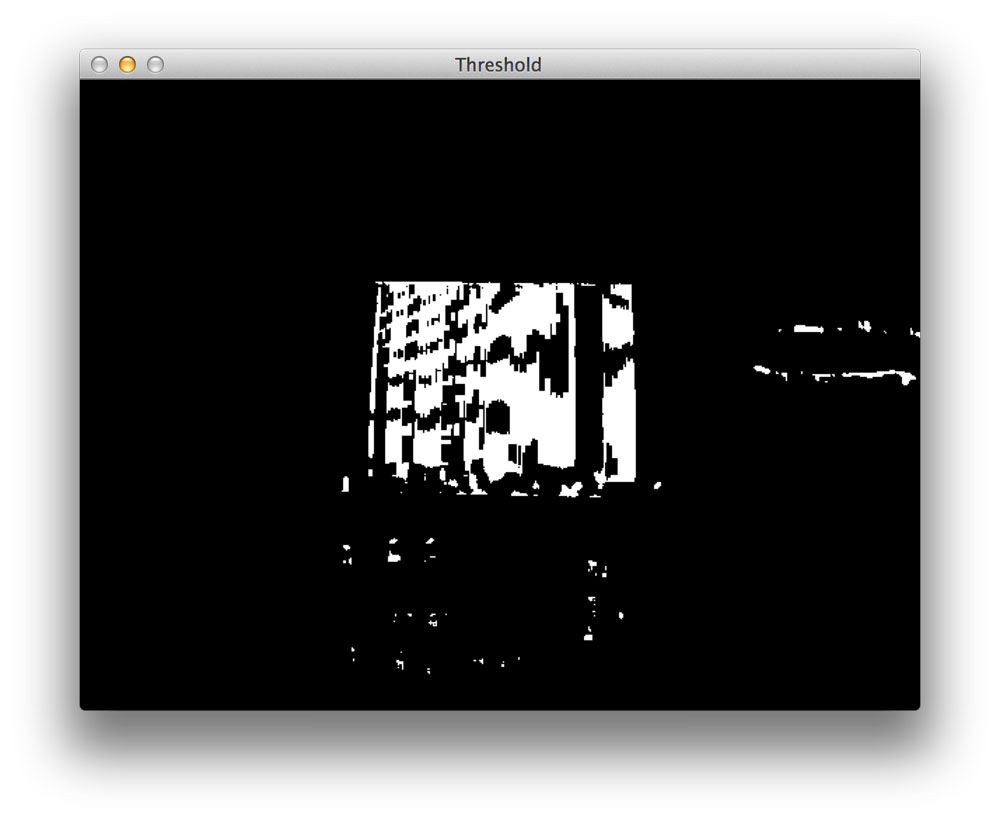
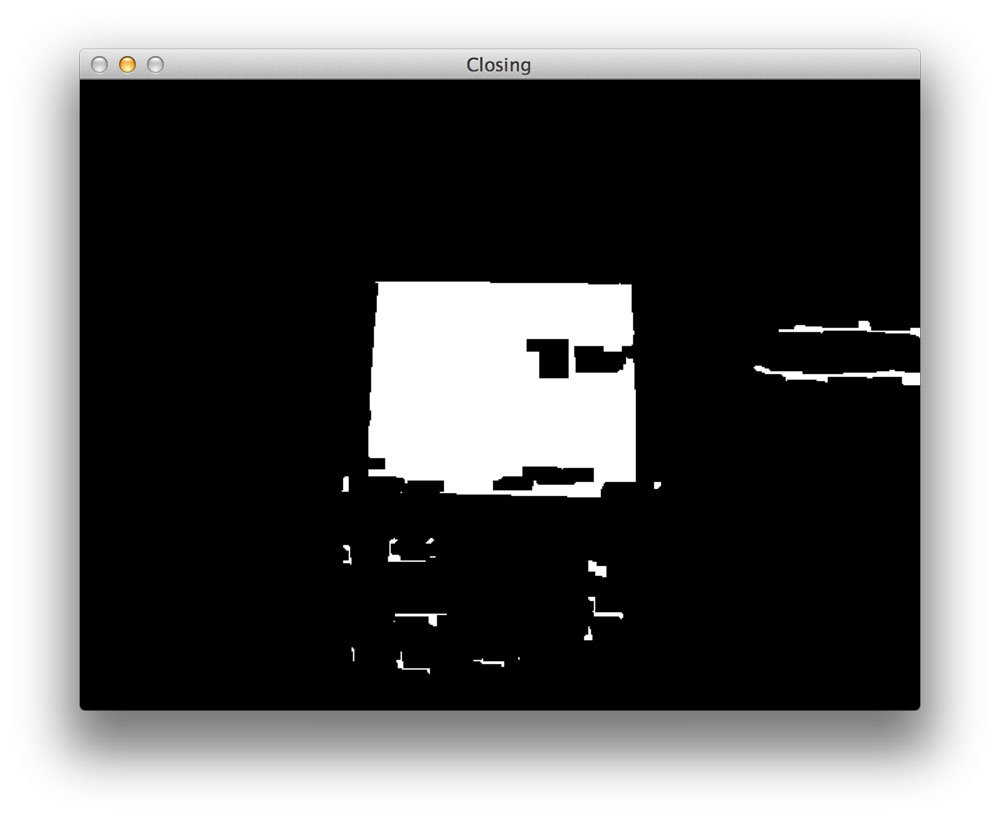
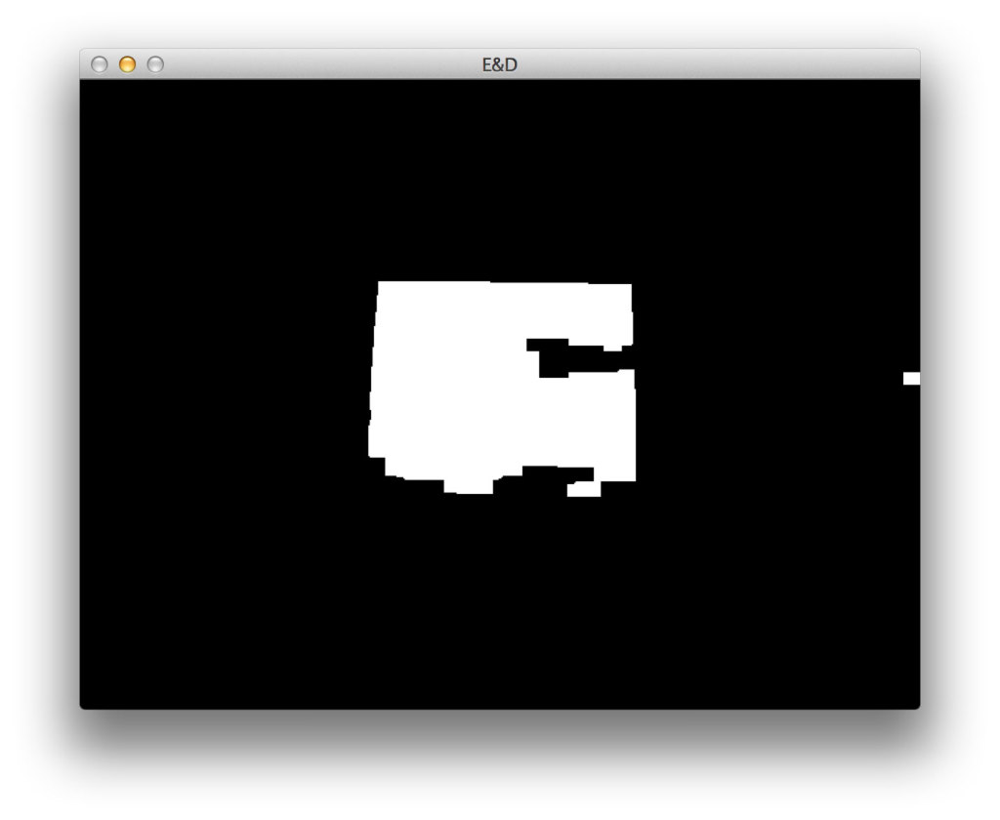

用python和opencv检测图像中的条形码


这篇博文的目标是演示使用计算机视觉和图像处理技术实现条形码的检测。

通过本篇文章的学习，我们能学到的内容包括：

1、图像处理中常用的一些操作流程，包括滤波、阈值化处理、膨胀、腐蚀和轮廓查找等

2、更重要的一点，希望通过这个案例，能够帮助大家建立分析问题和处理问题的思路

需要注意的是，这个算法并不适用于所有的条形码，但是它应该能给你一个基本的直觉，告诉你应该应用什么类型的技术。

对于下面这个例子，我们将检测下图中的条形码：


让我们继续写一些代码。打开一个新文件，将其命名为 detect_barcode.py，如何开始写代码：

```
#　导入必要的包/库
import numpy as np
import argparse
import imutils
import cv2

# 构造参数解析并分析参数
ap = argparse.ArgumentParser()
ap.add_argument("-i","--image", required = True, help = "path to the image file")
args = vars(ap.parse_args())
```

我们首先要做的是导入我们需要的包。我们将使用numpy进行数字处理，argparse用于解析命令行参数，cv2进行opencv绑定。

然后我们将设置命令行参数。我们这里只需要一个开关，即 --image，它是我们图像的路径，其中包含我们想要检测的条形码。

现在，让我进行实际的图像处理吧

```
#　导入图片并转化为灰度图
image = cv2.imread(args["image"])
gray = cv2.cvtColor(image, cv2.COLOR_BGR2GRAY)

# 计算图片x和y方向的Scharr梯度大小
ddepth = cv2.cv.CV_32F if imutils.is_cv2() else cv2.CV_32F
gradX = cv2.Sobel(gray, ddepth=ddepth , dx=1, dy=0, ksize=-1)
gradY = cv2.Sobel(gray, ddepth=ddepth , dx=0, dy=1, ksize=-1)

# 用x方向的梯度减去y方向的梯度
gradient = cv2.subtract(gradX,gradY)
gradient = cv2.convertScaleAbs(gradient)
```

首先我们先读入图片并将其转换为灰度图；

然后我们使用Scharr操作符（这里制定ksize=1）去构造图片在水平和垂直方向上的梯度幅值表示。

这里，我们用Scharr算子的x方向梯度减去y方向的梯度。通过这个相减操作，我们就只剩下了高水平梯度和低垂直梯度的图像区域。

我们上述原始图像的梯度表示如下图所示



请注意梯度操作是如何检测出图片的条形码区域的。接下来的步骤是如何过滤掉图片中的噪声，重点关注条形码区域。

```
#　对图片进行模糊和阈值化操作
blurred = cv2.blur(gradient,(9,9))
(_,thresh) = cv2.threshold(blurred, 255, 255, cv2.THRESH_BINARY)
```

我们做的第一件事是使用一个卷积核大小为9x9的均值滤波作用于梯度图片。对图片进行这个操作将有助于平滑图片中的高频噪声。

然后我将模糊化后的图片进行阈值化，在梯度图片中，所有的像素点的灰度值低于255的将设为0（黑色），其余设为255（白色）。

模糊和阈值化处理后的输出结果如下：



然而，正如你所看到的上图阈值化图片，在条形码的垂直方向上存在这间隙。为了缩小这些间隙，并使得我们的算法更加容易的检测出条形码的“斑点”状区域，我们需要执行一些基础的形态学操作：

```
#　构造一个闭合核并应用于阈值图片
kernel = cv2.getStructuringElement(cv2.MORPH_RECT, (21, 7))
closed = cv2.morphologyEx(thresh, cv2.MORPH_CLOSE, kernel)
```

我们通过使用函数cv2.getStructuringElement构造一个矩形核。这个核的宽度大于高度，因此允许我们缩小条形码垂直条带之间的间隙。



 当然，现在图片中非条形码的区域存在着很多斑点，这将会干扰轮廓的检测。

现在，我们继续尝试移除这些小的斑点

```
＃ 执行一系列的腐蚀和膨胀操作
closed = cv2.erode(closed, None, iterations = 4)
closed = cv2.dilate(closed, None, iterations = 4)
```

我们现在要做的是进行4次腐蚀操作，然后再进行4次膨胀操作。腐蚀操作将会“腐蚀”掉图片中的白色像素点，因此将会清除这些小的斑点，而膨胀操作将会“扩张”剩余的白色像素，并使白色区域变长。

如果在腐蚀过程中去除了小的斑点，则在膨胀的过程中不会再次出现。

在一系列的腐蚀和膨胀操作之后，这些小斑点已经被成功的移除了，只剩下条形码的区域。



最后寻找一下图片中条形码的区域的轮廓。

```
# 找到阈值化后图片中的轮廓，然后进行根据区域进行排序，仅保留最大区域
cnts = cv2.findContours(closed.copy(), cv2.RETR_EXTERNAL, cv2.CHAIN_APPROX_SIMPLE)
cnts = imutils.grab_contours(cnts)
c = sorted(cnts, key = cv2.contourArea, reverse = True)[0]

# 计算最大轮廓的旋转边界框
rect = cv2.minAreaRect(c)
box = cv2.cv.BoxPoints(rect) if imutils.is_cv2() else cv2.boxPoints(rect)
box = np.int0(box)

# 在检测到的条形码周围绘制边界框并显示图片
cv2.drawContours(image, [box], -1, (0,255,0), 3)
cv2.imshow("Image", image)
cv2.waitKey(0)
```

幸运的是，opencv中提供了相应的接口，可以很容易地找到图像中的最大轮廓，如果我们正确地完成了图像处理步骤，它应该会对应于条形码区域。

然后，我们确定最大轮廓的最小的边界框，并最后显示检测到的条形码。

正如我们下图所示，我们已经成功的检测到条形码


接下来，将尝试更多的图片。


