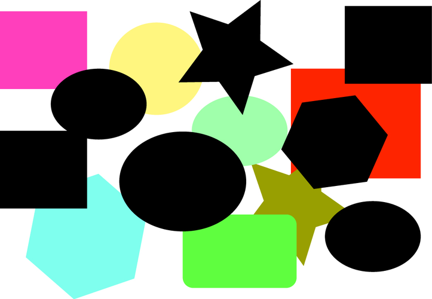
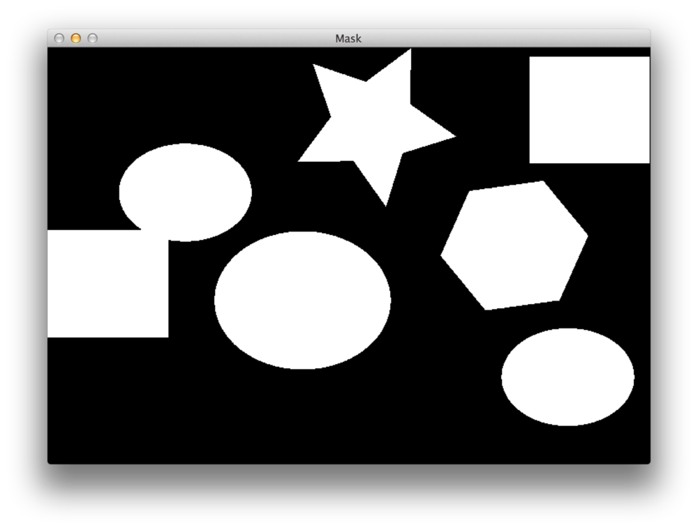

使用python和OpenCV查找图像中的形状



打开一个新的文件，并命名为find_shapes.py，然后开始进行操作

```python
#　导入必要的包
import numpy as np
import argparse
import imutils
import cv2

# 构造解析参数并分析参数
ap = argparse.ArgumentParser()
ap.add_argument("-i", "--image", help="paht to the image file")
args = vars(ap.parse_args())
```

我们首先要做的是导入我们需要的包。我们将使用numpy进行数字处理，argparse用于解析命令行参数，cv2进行OpenCV绑定。我的imutils包有一个方便的功能供我们使用。

处理分析命令行参数，我们只需要一个开关“--image”，这是磁盘上的路径。

最后我们导入图片，现在我们已经从磁盘中加载了图片，我们看继续检测图片中的黑色形状。

我们的目标是检测图片中的黑色形状。

检测这些黑色形状实际上可以通过使用cv2.inRange函数轻松的实现。

```python
# 导入图片
image = cv2.imread(args["image"])

# 寻找图片中的所有黑色形状
lower = np.array([0, 0, 0])
upper = np.array([15, 15, 15])
shapeMask = cv2.inRange(image, lower, upper)
```

上面我们在RGB颜色空间中定义了lower和upper的边界点。注意，OpenCV中存储图片是用BGR顺序的，而不是RGB。

lower（下边界）是由纯黑组成，即B、G、R三个通道的值各自都为0。

upper（上边界）是有一个非常深的灰色阴影组成，这次每个通道的值都指定为15。

然后我们寻找所有在上边界和下边界区间的像素点。

得到的shapeMask（形状掩模）如下图所示



正如我们所看见的，原图中所有的黑色形状现在都是在黑色背景上的白色物体。

下一步是在shapeMask上去检测轮廓，这个非常简单

```python
# 在mask上找到轮廓
cnts = cv2.findContours(shapeMask.copy(), cv2.RETR_EXTERNAL, cv2.AIN_APPROX_SIMPLE)
cnts = imutils.grab_contours(cnts)
print("I found {} black shapes".format(len(cnts)))
cv2.imshow("Mask", shapeMask)

# 遍历所有轮廓
for c in cnts:
    # 绘制轮廓并显示
    cv2.drawContours(image, [c], -1, (0, 255, 0), 2)
    cv2.imshow("Image", image)
    cv2.waitKey(0)
```

我们调用函数cv2.findContours，介绍它用于寻找所有形状的外部轮廓（即边界）。

使用imutils.grab_contours(cnts)的原因是由于不同版本的OpenCV处理轮廓的方式不同。

这里，我们可以将找到的轮廓数打印到控制台。

然后，我们开始遍历每个单独的轮廓，并在原始图片上画出这些形状的轮廓线。

至此，我们已经完成了所有的操作了。

运行一下代码，首先我们打开终端，然后输入以下的命令：

```python
python3 find_shapes.py --image shapes.png
```

假如没有报错，你将圈出所有的黑色形状，并在这些黑色形状上画出绿色的轮廓线。


真如你所见到的，我们已经在图片中找到了这些黑色的形状。

# 总结

在本文中，我们讨论了如何使用使用cv2.inRange和cv2.findContours函数在图片中查找形状。

**详细说明：**

**cv2.inRange(image, lower, upper)**

功能：将图片的RGB值限制在lower和upper的区间内，输出结果是Image

参数说明：image是输入图片，lower是下边界，upper是上边界


**cv2.findContours(input_img,cv2.RETR_TREE,cv2.CHAIN_APPROX_SIMPLE)**

功能：寻找轮廓，轮廓可以用于简单地解释为连接所有连续点（沿着边界）的曲线，具有相同的颜色或强度。轮廓线是形状分析、目标检测和识别的有用工具。cv2.findContours的输出结果是image，contours和hierarchy

参数说明：第一个参数input_img是源图像，第二个参数cv2.RETR_TREE是轮廓检索模式，第三个参数cv2.CHAIN_APPROX_SIMPLE是轮廓近似方法。

**第二个参数可选类型：**

 cv2.RETR_EXTERNAL表示只检测外轮廓     

cv2.RETR_LIST检测的轮廓不建立等级关系   

cv2.RETR_CCOMP建立两个等级的轮廓，上面的一层为外边界，里面的一层为内孔的边界信息。如果内孔内还有一个连通物体，这个物体的边界也在顶层

cv2.RETR_TREE建立一个等级树结构的轮廓

**第三个参数可选类型：**

cv2.CHAIN_APPROX_NONE存储所有的轮廓点，相邻的两个点的像素位置差不超过1，即max（abs（x1-x2），abs（y2-y1））==1
cv2.CHAIN_APPROX_SIMPLE压缩水平方向，垂直方向，对角线方向的元素，只保留该方向的终点坐标，例如一个矩形轮廓只需4个点来保存轮廓信息

cv2.CHAIN_APPROX_TC89_L1，CV_CHAIN_APPROX_TC89_KCOS使用teh-Chinl chain 近似算法

> https://blog.csdn.net/sunny2038/article/details/12889059