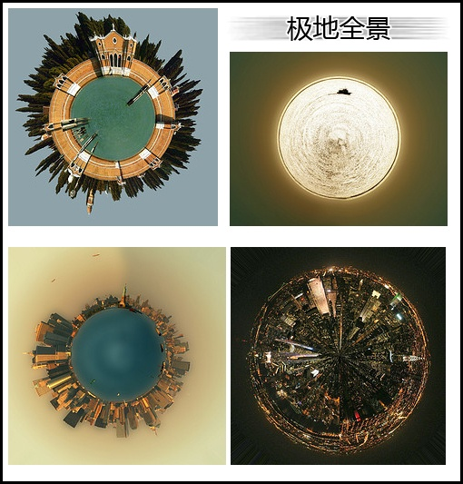
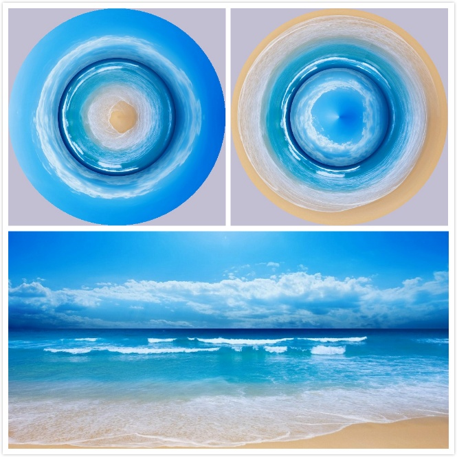
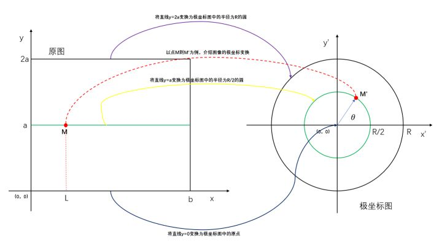

全景，通常是指符合人的双眼正常有效视角（大约水平90度，垂直70度）或包括双眼余光视角（大约水平180度，垂直90度）以上，乃至360度完整场景范围拍摄的照片。传统的光学摄影全景照片，是把90度至360度的场景（(柱形全景)）全部展现在一个二维平面上，把一个场景的前后左右一览无余地推到观者的眼前，更有所谓"完整"全景(球形全景)，甚至将头顶和脚底都"入画"了。随着数字影像技术和Internet技术的不断发展，可以用一个专用的播放软件在互联网上显示，并使用户用鼠标和键盘控制环视的方向，可左可右可近可远。使您感到就在环境当中，您好像在一个窗口中浏览外面的大好风光。 拍摄全景照片需要很复杂的技术，而今天我们用Photoshop就可以轻松的处理出全景特效图片。

http://www.16xx8.com/plus/view.php?aid=8095&pageno=all



那么对于想要秀一下这些酷炫的图片，又不会ps的小伙伴怎么办？难道要去学一下ps。

不存在的。

今天我们将用代码实现上面的效果。是不是非常的装逼？

本文将从极坐标变换的原理、代码实现和注意点等几个方面进行详细的讲解，看完之后，我想大家收获的不只是ctrl+c和ctrl+v的使用，而是我的天，原来图像技术，数学可以这样子玩，我要好好跟着小编一起学习进步【明示关注和分享】。

这是我的第四期分享图像技术的应用分析，其他的可以参看：


1、原理

下图展示一张沙滩场景拍摄的图片，在两个方向【上和下】进行极坐标变换后的效果。



通过对拍摄到的照片转变成炫酷的极坐标全景图。

首先我们从数学的角度去分析，上图到底是如何转换的：



上图是从一张正常拍摄的图片转换到极坐标全景图的示意图。

从数学公式上的对应关系来看

从直角坐标系的坐标【已知，（x, y）】变换到极坐标的坐标【待求解(x’, y’ )】变换对应关系为：

在极坐标系中

θ = 2 * π * **M**的横坐标 / 原图像的宽 = 2 * π * x / b；

r = 半径缩放系数 * **M**的纵坐标 = ρ * y；其中：ρ = 极坐标图的R / 原图像的高 = R / (2 * a)；

拥有了上面的计算公式，我们便可以找到每一个直角坐标系中的点经过极坐标变换后在极坐标系中对应的位置。当然求出 角度θ 和半径r后还需要转换为极坐标图中的平面直角坐标【显示需要】

计算公式为：


将M处的灰度值，赋值给M‘处像素点的灰度值


3、代码实现

关键代码讲解：

```
# 准备工作，计算原图像尺寸和变换后的图片大小
x0 = img.shape[0]
y0 = img.shape[1]
# 最大半径计算
radius = int(y0/(2*math.pi))
w=2*radius
h=2*radius
wrapped_img = 255*np.ones((w, h, 3), dtype="u1")

except_count = 0
for j in range(y0):
    # 1. 求极坐标系中对应的角度theta
    theta = 2 * math.pi * (j /y0)  
    # print(theta)
    for i in range(x0):
    	# 2. 计算半径缩放系数
        wrapped_radius = -(i-x0)*radius/x0
        # 3. 利用对应关系进行换算
        y = wrapped_radius * math.cos(theta) + radius  
        x = wrapped_radius * math.sin(theta) + radius
        x, y = int(x), int(y)
        try:
            wrapped_img[x, y, :] = img[i, j, :] 
            # 注意点,在数学坐标系中的坐标与数字图像中的坐标表示存在差异需要注意
        except Exception as e:
            except_count = except_count + 1

```


4、注意点

（1）数学中的直角坐标与数字图像的直接坐标是不同的

通常数学，数字图

（2）图片转换到极坐标图中，其原点并非是圆心的位置，而是经过一个偏移，偏移量一般为x和y方向移动半径r的距离

（3）从原图到极坐标图像的转换中，并非所有点均可以一一对应，这里我采用的方法是将原图的尺寸扩大一倍，来增加对应点，原作者提到的采用插值操作进行优化有异曲同工之妙

（4）接缝处存在比较明显的拼接痕迹，这里我采用ROI进行平滑，但是效果不好，原作者对原图的前后侧边采用alpha融合优化，这里还需要优化，欢迎后续同学有更好的方案分享学习。

（5）同理将极坐标变换后的图片展开其原理是类似的，这里就不多叙述。


5、总结

