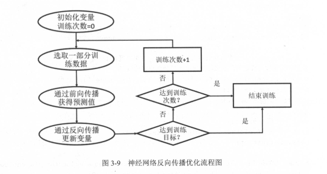

# 神经网络样例

## 反向传播算法训练神经网络的流程图

监督学习最重要的思想就是，在己知答案的标注数据集上 ，模型给出的预测结果要尽量接近真实的答案。通过调整神经网络中的参数对训练数据进行拟合，可以使得模型对未知的样本提供预测的能力。

在神经网络优化算法中,最常用的方法是反向传播算法，下图展示了使用反向传播算法训练神 经网络的流
程图。




反向传播算法实现了一个法代的过程。在每次迭代的开始，首先需要选取一小部分训练数据 ，这一小部分数据叫做一个batch 。然后，这个 batch 的样例会通过前向传播算法得到神经网络模型的预测结果。因为训练数据都是有正确答案标注的，所以可以计算出当前神经网络模型的预测答案与正确答案之间的差距。最后，基于预测值和真实值之间的差距，反向传播算法会相应更新神经网络参数的取值，使得在这个batch上神经网络模型的预测结果和真实答案更加接近。

下面给出了一个完整的程序来训练神经网络解决二分类问题 。

```
import tensorflow as tf
# numpy 是一个科学计算的工具包，这里通过NumPy工具包生成模拟数据集
from numpy.random import RandomState
# 定义训练数据batch的大小
batch_size = 8
#　定义神经网络的参数
w1 = tf.Variable(tf.random_normal([2,3],stddev=1,seed=1))
w2 = tf.Variable(tf.random_normal([3,1],stddev=1,seed=1))
# 在shape的一个维度上使用None可以方便使用不同的batch大小。在训练时需要把数据分成
# 比较小的batch，但在测试时，可以一次性使用全部的数据，当数据集比较小时这样子比较
# 方便测试，但数据比较大时，将大量数据放入一个batch可能会导致内存溢出
x = tf.placeholder(tf.float32, shape=(None,2), name='x-input')
y_ = tf.placeholder(tf.float32, shape=(None,1), name='y-input')
# 定义神经网络前向传播的过程
a = tf.matmul(x, w1)
y = tf.matmul(a, w2)
# 定义损失函数和反向传播算法
y =  tf.sigmoid(y)

# 定义损失函数和反向传播算法
cross_entropy = -tf.reduce_mean(y_*tf.log(tf.clip_by_value(y,1e-10,1.0))
                               +(1-y)*tf.log(tf.clip_by_value(1-y,1e-10,1.0)))
train_step = tf.train.AdamOptimizer(0.001).minimize(cross_entropy)
# 通过随机数生成一个模拟数据集
rdm = RandomState(1)
dataset_size = 128
X = rdm.rand(dataset_size, 2)
# 定义规则来给出样本的标签。在这里所有 x1+x2<1 的样例都被认为是正样本( 比如零件合格) ,
# 而其他为负样本( 比如零件不合格)
Y = [[int(x1+x2<1)] for (x1,x2) in X]
# 创建一个会话来运行TensorFlow程序
with tf.Session() as sess:
    init_op = tf.global_variables_initializer()
    # 初始化变量
    sess.run(init_op)
    print(sess.run(w1))
    print(sess.run(w2))
    '''
     在训练之前神经网络参数的值
    [[-0.8113182   1.4845988   0.06532937]
     [-2.4427042   0.0992484   0.5912243 ]]
    [[-0.8113182 ]
     [ 1.4845988 ]
     [ 0.06532937]]    
   
    '''
   
    # 设定训练的轮数
    STEPS = 5000
    for i in range(STEPS):
        # 每次选取batch_size个样本进行训练
        start = (i*batch_size) % dataset_size
        end = min(start + batch_size,dataset_size)
        # 通过选取的样本训练神经网络并更新参数
        sess.run(train_step,feed_dict={x:X[start:end],y_:Y[start:end]})
        if i % 1000 ==0:
            # 每隔一段时间计算在所有数据上的交叉熵并输出
            total_cross_entropy = sess.run(cross_entropy,feed_dict={x:X,y_:Y})
            print("After %d training step(s),cross entropy on all data is %g"%(i,total_cross_entropy))
            '''
            After 0 training step(s),cross entropy on all data is 0.314006
            After 1000 training step(s),cross entropy on all data is 0.0684551
            After 2000 training step(s),cross entropy on all data is 0.033715
            After 3000 training step(s),cross entropy on all data is 0.020558
            After 4000 training step(s),cross entropy on all data is 0.0136867
            '''
    print(sess.run(w1)) 
    print(sess.run(w2))
    '''
    [[-2.548655   3.079309   2.895171 ]
     [-4.1112742  1.6259072  3.3972702]]
    [[-2.3230937]
     [ 3.3011687]
     [ 2.4632082]]
    '''
```

以上程序实现了训练神经网络的全部过程。从这段程序可以总结出训练神经网络的过程可以分为以下三个步骤 :

1.  定义神经网络的结构和前向传播的输出结果。
2. 定义损失函数以及选择反向传播优化的算法 。
3. 生成会话( tf. Session )并且在训练、数据上反复运行反向传播优化算法。 

无论神经网络的结构如何变化 ,这三个步骤是不变的