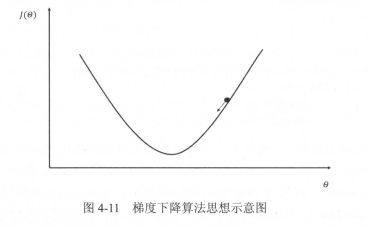
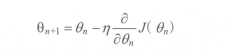
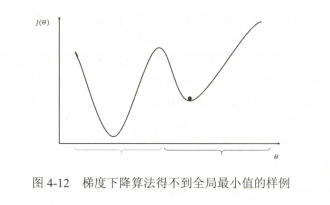
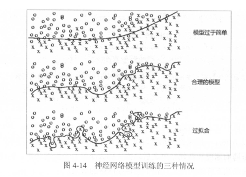

[TOC]


## 神经网络优化算法

本节将会具体介绍如何通过方向传播算法（backpropagation）和梯度下降算法（gradient decent）调整神经网络中参数的取值。

梯度下降算法主要用于**优化单个参数的取值**，而反向传播算法给出了一个高效的方式在**所有参数上**使用梯度下降算法，从而使神经网络模型在训练数据上的损失函数尽可能小。反向传播算法是训练神经网络的核 心算法，它可以根据定义好的损失函数优化神经网络中参数的取值，从而使神经网络模型在训练数据集上的损失函数达到一个较小值。神经网络模型中参数的优化过程直接决定了模型的质豆 ，是使用神经网络时非常重要的一步。

假设用 Θ 表示神经网络中的参数，损失函数 J（Θ）表示在给定的参数取值下，训练数据集上损失函数的大小，那么整个优化过程中可以抽象为一个寻找一个参数Θ，使的 J（Θ）最小。

梯度下降算法是最常用的神经网络优化方法，梯度下降算法会更新参数Θ，不断沿着梯度的反方向让参数朝着总损失更小的方向更新。



图4-11中 x 轴表示参数 Θ 的取值，y 轴表示损失函数 J（Θ）的值。假设小黑点是当前点，为了使损失函数 J（Θ）变小（朝着左边移动），此时梯度下降算法通过求偏导（曲线的话直接求导），还需要定义一个学习率 η 来定义每次参数更新的幅度。通过参数的梯度和学习率，参数更新公式为：



对于梯度不理解的小伙伴可以参看：[梯度](https://baike.baidu.com/item/%E6%A2%AF%E5%BA%A6/13014729?fr=aladdin)

对于更新参数的理解，参数 Θ 更新实际上是要让损失函数变小，从图4-11上应该往左边移动，但是我们要以什么依据来决定移动的距离，科学家选择以梯度和学习率作为依据，但是实际上从上图可以直观的看出梯度是正的，如果参数更新是直接将 Θ 更新部分相加是不正确的，因为我们目标是希望让损失函数尽可能小，而梯度大于0此时损失函数会增大，所以在学习率和梯度前面加一个符号，才能达到我们的目标。

需要注意的是，**梯度下降算法并不能保证被优化的函数达到全局最优解**。如图4-12所示，在小黑点处，此时损失函数的偏导为0，于是参数就不会进一步更新。

最有当损失函数为凸函数时，梯度下降算法才能保证达到全局最优解。



**梯度下降的另一个问题是计算时间太长**。因为要在全部训练数据上最小化损失，所以损失函数是在所有训练数据上的损失和 。这样在每一轮迭代中都需要计算在全部训练数据上的损失函数 。在海量训练数据下，要计算所有训练数据的损失函数是非常消耗时间的。

为了加速训练过程 , 可以使用随机梯度下降的算法 （ stochastic gradient descent ）。这个算法优化的不是在全部训练数据上的损失函数，而是在每一轮法代中,随机优化某一条训练数据上的损失函数 。 这样每一轮参数更新的速度就大大加快了。因为随机梯度下降算法每次优化的只是**某一条数据**上的损失函数，所以它的问题也非常明显：在某一条数据上损失函数更小并不代表在全部数据上损失函数更小，于是使用随机梯度下降优化得到的神经网络甚至可能无法达到局部最优。

为了综合梯度下降算法和随机梯度下降算法的优缺点。在实际应用中 一般采用这两个算法的折中——每次计算一小部分训练数据的损失函数。这一小部分数据被称之为一个batch。通过矩阵运算，每次在一个 batch 上优化神经网络的参数并不会比单个数据慢太多 。另一方面，每次使用 一个 batch 可以大大减小收敛所需要的法代次数，同时可以使收敛到的结果更加接近梯度下降的效果。


## 神经网络进一步优化

#### 学习率的设置

学习率决定了参数每次更新的幅度。学习率既不能过大，也不能过小。过大将可能导致不能收敛，过小会大大降低优化速度。

为了解决设定学习率的问题，TensorFlow提供了一种更加灵活的学习率设置方法——指数衰减法。

tf.train.exponential_decay函数实现了指数衰减学习率。

```
global_step = tf.Variable(0)
# 通过 exponential_decay 函数生成学习率
learning_rate = tf.train.exponential_decay(
				0.1,global_step,100,0.96,staircase=True)
# 使用指数衰减的学习惑。在 minimize 函数 中传入 global_step将自动更新
# global_step 参数,从而使得学习率也得到相应更新。
learning_step = tf.train.GradientDescentOptimizer(learning_rate)\
				.minimize(...my_loss ,)
```

上面这段代码中设定了初始学习率为 0.1 ,因为指定了 staircase=True ,所以每训练 100轮后学习率乘以 0.96 。 一般来说初始学习率、衰减系数和衰减速度都是根据经验设置的。而且损失函数下降的速度和法代结束之后总损失的大小没有必然的联系。也就是说并不能通过前几轮损失函数下降的速度来比较不同神经网络的效果。

#### 过拟合问题

所谓的过拟合，指的是当一个模型过为复杂之后，它可以很好地“记忆”每一个训练数据中随机噪声的部分而忘记了要去“学习”训练数据中通用的趋势。

图4-14显示了模型训练的三种不同情况。在第一种情况下，由于模型过于简单，无法刻画问题的趋势。第二个模型是比较合理的，它既不会过于关注训练数据中的噪声，又能够比较好地刻画问题的整体趋势。第三个模型就是过拟合了，虽然第三个模型完美地划分了不同形状的点，但是这样的划分并不能很好地对未知数据做出判断，因为它过度拟合了训练数据中的噪声而忽视了问题的整体规律。



为了避免过拟合问题。一个非常常用的方法是正则化（regularization）。正则化的思想就是在损失函数中加入刻画模型复杂程度的指标。L1正则化和L2正则化

基本思想都是希望通过限制权重的大小，使得模型不能任意你和训练数据中的随机噪声。

L1正则化会让参数变得更稀疏，而L2正则化不会。——稀疏——>有更多的参数变为0

L1的计算格式不可导，L2可导

```
import tensorflow as tf
# 获取一层神经网络边上的权重，并将这个权重的L2正则化损失加入名称为‘losses’的集合中
def get_weight(shape, lambda):
    # 生成一个变量
    var = tf.Variable(tf.random_normal(shape), dtype=tf.float32)
    # add_to_collection函数将这个新生成变量的L2正则化损失项加入集合
    # 这个函数的第一个参数‘losses'是集合的名字，第二个参数是加入这个几何的内容
    tf.add_to_collection(
        'losses', tf.contrib.layers.l2_regurizer(lambda)(var))
    # 返回生成的变量
    return var
x = tf.placeholder(tf.float32, shape=(None, 2))
y_ = tf.placeholder(tf.float32, shape=(None, 1))
batch_size = 8
# 定义了每一层网络中节点的个数
layer_dimension = [2, 10, 10, 10, 1]
# 神经网络的层数
n_layers = len(layer_dimension)

# 这个变量维护前向传播时最深层的节点，开始的时候就是输入层。
cur_layer = x
# 当前层的节点个数
in_dimension = layer_dimension[0]

# 通过一个循环来生成5层全连接的神经网络结构
for i in range(1,n_layers):
    # layer_dimension[i]为下一层的节点个数
    out_dimension = layer_dimension[i]
    # 生成当前层中权重的变量，并将这个变量的L2正则化损失加入计算图上的集合
    weight = get_weight([in_dimension, out_dimension], 0.001)
    bias = tf.Variable(tf.constant(0.1, shape=[out_dimension]))
    # 使用ReLU激活函数
    cur_layer = tf.nn.relu(tf.matmul(cur_layer, weight)+bias)
    # 进入下一层之前将下一层的节点个数更新为当前层节点个数
    in_dimension =layer_dimension[i]
    
# 在定义神经网络前向传播的同时已经将所有的L2正则化损失加入了图上的集合
# 这里只需要计算刻画模型在训练数据上表现的损失函数
mse_loss = tf.reduce_mean(tf.square(y_ - cur_layer))

# 将均方差损失函数加入损失集合
tf.add_to_collection('losses', mse_loss)

# get_collection返回一个列表，这个列表是所有这个集合中的元素。在这个样例中，
# 这些元素就是损失函数的不同部分，将它们加起来就可以得到最终的损失函数
loss = tf.add_n(tf.get_collection('losses'))
```

滑动平均模型

```
import tensorflow as tf
# 定义一个变盐用于计算滑动平均,这个变量的初始值为 0 。注意这里手动指定了变量的
# 类型为 tf.float32 ,因为所有需要计算滑动平均的变量必须是实数型。
v1 = tf.Variable(0, dtype=tf.float32)
# 这里step变量模拟神经网络中迭代的轮数，可以用于动态控制衰减率
step = tf.Variable(0, trainable=False)

# 定义1个滑动平均的类(class)。初始化时给定了哀减率(0.99)和控制衰减率的变量 step 。
ema = tf.train.ExponentialMovingAverage(0.99, step)
# 定义 一个更新变量滑动半均的操作。这里需要给定 一个列表,每次执行这个操作时
# 这个列表中的变量都会被更新。
maintain_averages_op = ema.apply([v1])

with tf.Session() as sess:
    # 初始化所有变量
    init_op = tf.global_variables_initializer()
    sess.run(init_op)
    
    # 通过ema.average(v1)获取滑动平均之后变量的取值。在初始化之后
    # 变量v1的值和v1的滑动平均都为0
    print(sess.run([v1, ema.average(v1)]))
    
    sess.run(tf.assign(v1, 5))
    
    sess.run(maintain_averages_op)
    print(sess.run([v1, ema.average(v1)]))
    
    
```

