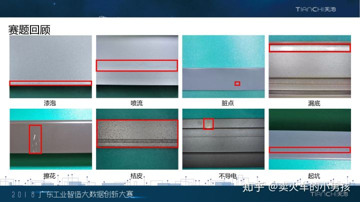

天池：铝型材表面瑕疵识别

https://tianchi.aliyun.com/competition/entrance/231682/introduction

作者1：https://zhuanlan.zhihu.com/p/50548998

代码1：https://github.com/herbert-chen/tianchi_lvcai

https://github.com/OdingdongO/pytorch_classification

作者2：https://blog.csdn.net/nima1994/article/details/82783546

代码2：https://github.com/lsh1994/tianchiorgame/tree/master/tianchi_defectIdentify_1809

比赛介绍：

铝型材是佛山南海的支柱性产业。在铝型材的实际生产过程中，由于各方面因素的影响，铝型材表面会产生裂纹、起皮、划伤等瑕疵，这些瑕疵会严重影响铝型材的质量。为保证产品质量，需要人工进行肉眼目测。然而，铝型材的表面自身会含有纹路，与瑕疵的区分度不高。传统人工肉眼检查十分费力，不能及时准确的判断出表面瑕疵，质检的效率难以把控。近年来，深度学习在图像识别等领域取得了突飞猛进的成果。铝型材制造商迫切希望采用最新的AI技术来革新现有质检流程，自动完成质检任务，减少漏检发生率，提高产品的质量，使铝型材产品的生产管理者彻底摆脱了无法全面掌握产品表面质量的状态。本次大赛选择南海铝型材标杆企业的真实痛点作为赛题场景，寻求解决方案，助力企业实现转型升级，提升行业竞争力。 

竞赛规则：

- 使用某企业某一产线某一时间段获取的铝型材图片，训练算法来定位瑕疵所在位置以及判断瑕疵的类型。
  瑕疵的衡量标准如下：

- 1. 型材表面应整洁，不允许有裂纹、起皮、腐蚀和气泡等缺陷存在。
  2. 型材表面上允许有轻微的压坑、碰伤、擦伤存在，其允许深度装饰面≯0.03mm，非装饰面＞0.07mm，模具挤压痕深度≯0.03mm。
  3. 型材端头允许有因锯切产生的局部变形，其纵向长度不应超过10mm。
  4. 工业生产过程中，不够明显的瑕疵也会被作为无瑕疵图片进行处理，不必拘泥于无瑕疵图片中的不够明显的瑕疵。
  5. 初赛图片结果为单标签，即一张图片只有一种瑕疵。“其他”文件夹中的瑕疵初赛不要求细分，但是统一划分为一类，即“其他”。
  6. **复赛图片分成单瑕疵图片、多瑕疵图片以及无瑕疵图片：单瑕疵图片指所含瑕疵类型只有一种的图片，但图片中可能出现多处相同类型的瑕疵；多瑕疵图片指所含瑕疵类型多于一种的图片**；无瑕疵图片指瑕疵可忽略不计的图片，这些图片不需要标注。
  7. 图片采用矩形框进行标注，标注文件储存成json文件，**采用utf-8的编码格式**，可通过labelme标注工具直接打开。Labelme是一款开源标注工具，有关labelme和json文件格式的介绍请选手通过网络自行了解。

