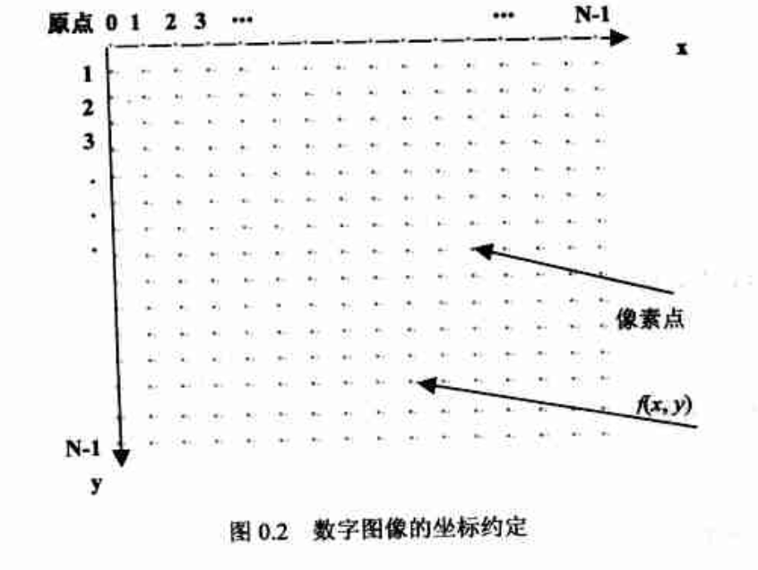
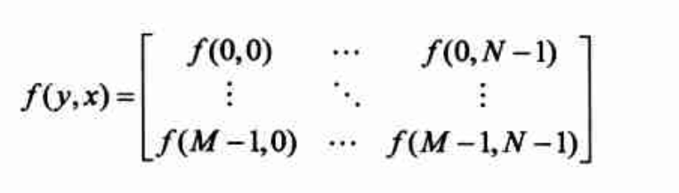
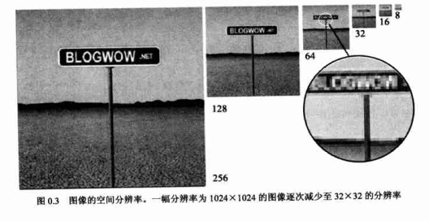
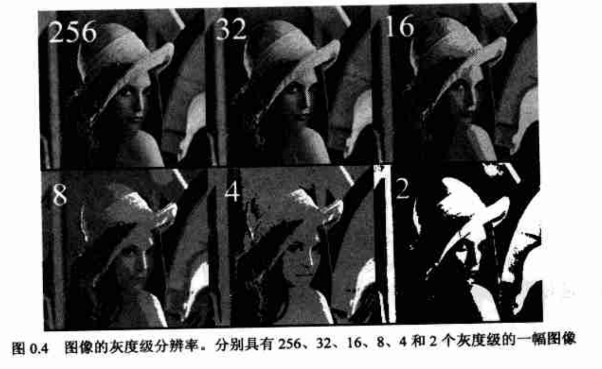
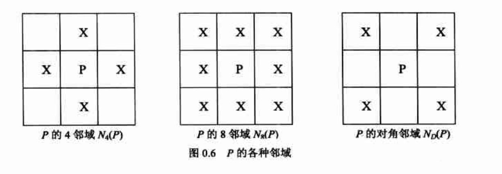
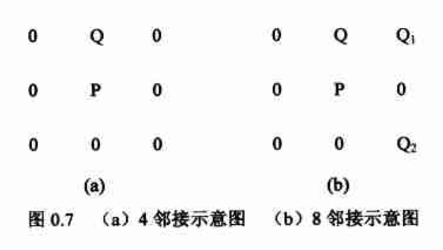
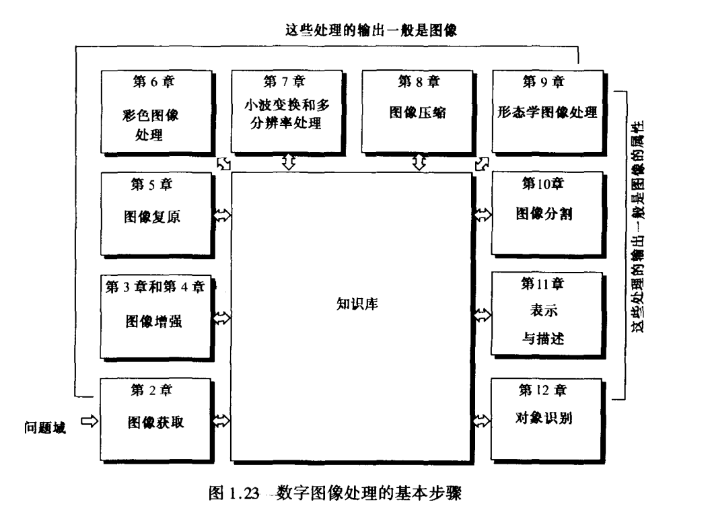

[TOC]

# 数字图像处理概述

## 什么是数字图像

图像是指能在人的视觉系统中产生视觉印象的客观对象，包括自然景物、拍摄到的图片、用数学方法描述的图形。

自然界中的图像都是模拟量。计算机只能处理数字量，而不能直接处理模拟图像，所以我们需要在使用计算机处理图像之前进行图像数字化。

数字图像是能够在计算机上显示和处理的图像，根据其特性可分为两大类——位图和矢量图。位图通常是使用数字阵列来表示，常见的格式有BMP、JPG、GIF等；矢量图由矢量数据库表示，最常见的格式为PNG。

一幅图像可以定义为一个二维函数
$$
f（x，y）
$$
其中，x和y是空间坐标，在x-y平面中任何一对空间坐标（x，y）上的幅值 f 称为该点图像的强度、亮度或灰度。当x，y和幅值 f 为有限的、离散的数值时，称该图像为数字图像。

#### 数字图像的分类

根据每个像素所代表信息的不同，可将图像分为二值图像、灰度图像、RGB图像以及索引图像等。

**二值图像**，只有黑白两种颜色的图像称为二值图像，一般用0来表示黑色，用1表示白色；

**灰度图像**，在二值图像中进一步加入许多介于黑色与白色之间的颜色深度，即构成了灰度图像；

RGB**图像**，对于每个像素，通过控制R（红，red）、G（绿，green）、B（蓝，blue）三原色的合成比例则可决定该像素的最终显示颜色；

**索引图像**，在表示图像的矩阵中用颜色表中的索引作为数据写入相应的行列位置，达到节省存储空间的目的。

#### 数字图像的表示

为了表述像素之间的相对和绝对位置，通常还需要对像素的位置进行坐标约定。

在此之后，一幅物理图像就被转化成了数字矩阵。数字图像 f 的矩阵表示如下所示：

其中，行列（M行N列）必须为正整数，离散灰度级数目L一般为2的k次幂，k为整数。

**图像的空间分辨率**

**图像的空间分辨率**是指图像中每单位长度所包含的像素或点的数目，常以像素/英寸（pixels per inch，ppi）为单位来表示。

为了让大家更加直观理解分辨率的概念，请看下图

**图像的灰度级/辐射计量分辨率**，在数字图像处理中，灰度级分辨率又成色阶，是指图像中可分布的灰度级数目L，L与存储灰度级别所使用的数据类型有关。随着图像灰度级分辨率的逐渐降低，图像中包含的颜色数目变少，从而在颜色的角度造成图像信息受损，同样使图像细节表达收到一定影响，如下图所示

## 数字图像处理的预备知识

### 邻接性、连通性、区域和边界

图像中像素P的4领域和8领域，各种领域如下图所示

**邻接性**，定义V是用于决定邻接性的灰度值集合，它是一种相似性的度量，用于确定所需判断邻接性的像素之间的相似程度。

4邻接：如果Q∈N4（P），则称具有V中数值的两个像素 P 和 Q 是4邻接的；

8邻接：如果Q∈N8（P），则称具有V中数值的两个像素 P 和 Q 是8邻接的；

示意图（对照这4邻域和8邻域能帮助你理解）

**连通性**，令 S 代表一幅图像中的像素子集。如果在 S 中全部像素之间存在一个通路，则可以称为2个像素P和Q在S中的是连通的。

[B站学习资料](https://www.bilibili.com/video/av22153795/?p=5)

**区域和边界**，区域是定义在连通集的基础上的。令 R 是图像中的一个像素子集，如果R同时是连通集，则称 R 为一个区域（Region）。边界（Boundary）的概念是相对于区域而言的。一个区域的边界（或边缘、轮廓）是区域中所有包含一个或多个不在区域 R 中的邻接像素的像素所组成的集合。

**注意点：边界和边缘是不同的。边界是和区域有关的的全局概念，而边缘表示图像函数的局部性质。**

### 距离度量的几种方法

（１）欧式距离，即距离等于 r 的像素形成以 P 为圆心的圆
$$
D_{e}(P,Q)=\sqrt{(x_{p}-x_{q})^2+(y_{p}-y_{q})^2}
$$
（２）D4距离（街区距离），即距离等于 r 的像素形成以 Ｐ为中心的菱形
$$
D_{4}(P,Q)=|x_{p}-x_{q}|+|y_{p}-y_{q}|
$$
（３）D８距离（棋盘距离），即距离等于 r 的像素形成以 Ｐ为中心的方形
$$
D_{8}(P,Q)=max(|x_{p}-x_{q}|,|y_{p}-y_{q}|)
$$

## 数字图像处理方法的两个主要应用领域：

（1）对图像信息进行改进，便于人们分析

（2）对图像数据进行存储、传输及显示，使机器能自动理解

## 数字图像处理的基本步骤

数字图像处理的两类常见输入输出内容是：

（1）输入和输出都是图像

（2）输入是图像，但是输出是从图像中提取的特征属性

基本步骤：

（1）图像获取，图像的获取是数字图像处理的第一步，其过程通过包括设置比例尺等预处理；

（2）图像增强，其思路是显示那些被模糊了的细节，或简单地突出一幅图像中感兴趣的特征。注意点，图像增强是图像处理中非常主观的领域；

（3）图像复原，与图像增强不同，图像复原是客观的，在某种意义上说，复原技术倾向于以图像退化的数学或概率模型为基础；

（4）图像压缩，减少图像的存储量，或者在传输图像时降低频带；

（5）形态学处理，涉及提取图像元素的工具，在表现和描述形状方面非常有用；

（6）图像分割，将一幅图像划分为组成部分或目标物；

（7）表示与描述，几乎总是跟随在分割步骤的输出后边，通常这一输出是未加工的数据，其构成不
是区域的边缘(区分一个图像区域和另一个区域的像素集)就是其区域本身的所有点；

（8）对象识别，基于目标的描述给目标赋以符号的过程。

