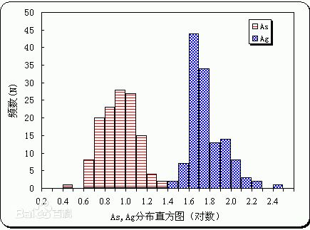
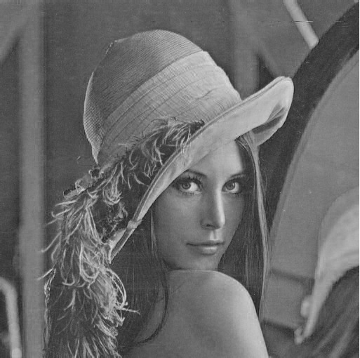
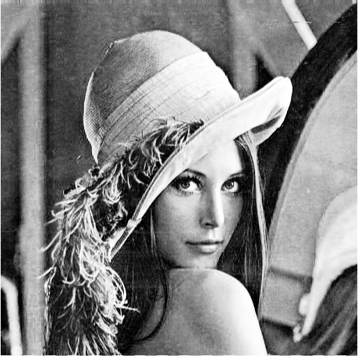
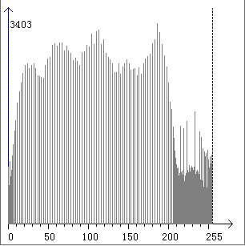
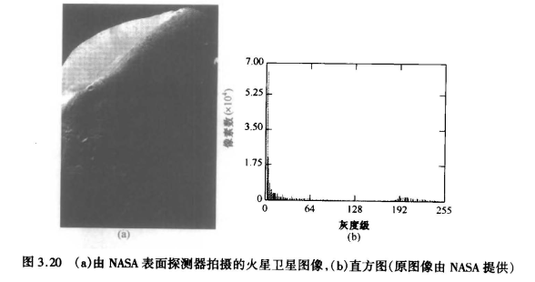
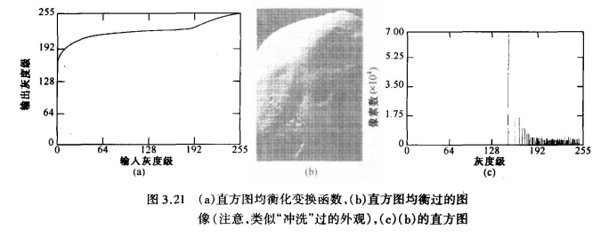
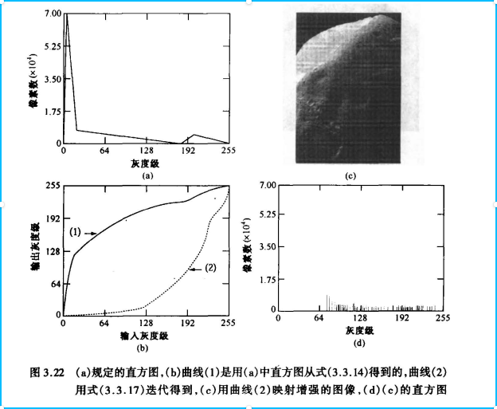
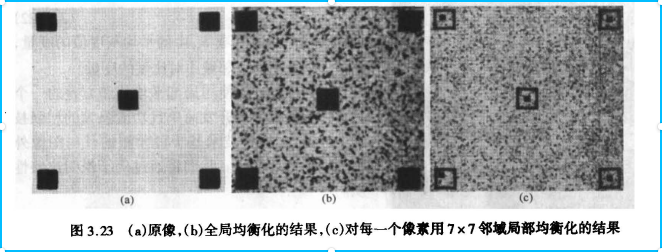
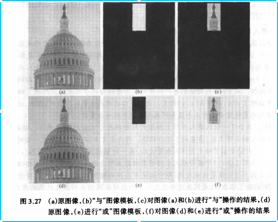

[TOC]

## 直方图处理

[直方图](https://baike.baidu.com/item/%E7%9B%B4%E6%96%B9%E5%9B%BE/1103834?fr=aladdin)一般用x轴表示数据类型，y 轴表示分布情况。

灰度级为[0, L-1 ]范围的数字图像的直方图是离散函数
$$
h(r_{k})=n_{k}
$$
这里rk是第k级灰度，nk是图像中灰度级为rk的像素个数。

对于暗色图像中，直方图的组成成分几种在灰度级低（暗）的一侧。类似地，明亮的图像的直方图则倾向于灰度级高的一侧。下图展示不同类型的图像的直方图分布情况，

### 直方图均衡化

**基本思想**：把原始图的直方图变换为均匀分布的形式，这样就增加了像素灰度值的动态范围，从而达到增强图像整体对比度的效果

**推导：**

考虑连续函数并且让变量 r 代表待增强图像的灰度级。假设 r 被归一化到区间 [0, 1]，且r =0 代表黑色及r = 1 代表白色。然后，考虑一个离散公式并允许像素值在区间 [0, L-1] 内。

对于任一个满足上述条件的 r ，我们将注意力集中在变换形式上：
$$
s = T(r) \quad 0≤r≤1
$$
在原始图像中对于每一个像素值 r 产生一个灰度值 s 。显然，可以假设变换函数 T（r）满足一下条件：

（a）T（r）在区间 0≤r≤1中为单值且单调递增

（b）当0≤r≤1时，0≤T（r）≤1

条件（a）中要求 T（r）为单值是为了保证反变换存在，单调条件保持输出图像**从黑到白顺序增加**。条件（b）保证输出灰度级与输入有同样的范围。

看几个直方图均衡化的例子：用实际的直方图来看，直方图均衡化后的效果。

|  |  |
| ------------------------------- | ------------------------------- |
|  |  |

。。。

[直方图均衡化](https://blog.csdn.net/xiajun07061225/article/details/6910129)

个人理解：

（1）从变换函数T（r）的定义，其单调则说明了，直方图均衡化会更加突出亮（灰度值高）的区域

（2）输入的灰度级 r 被归一化到[0,1]，并在归一化后的区间进行变换操作，且T（r）是单调的，因此相当于对其进行分散处理（仅代表个人的说法）

理由：为啥说是分散处理？

假设灰度级的分布（0-255），而一般情况可能都是小于这个区间的值，即有可能的灰度级分布是0-128，然后进行归一化，再重新分布，最后又映射到0-255的范围，此时的情况一定是一个分散的情况。

### 直方图匹配（规定化）

**目的**：指定希望处理的图像所具有的直方图形状

**操作步骤**：

1.求出已知图像的直方图

2.利用式（3.3.13）对每一个灰度级rk预计算映射灰度级sk

3.利用式（3.3.14）从给定的Pz（z）得到变换函数G

4.利用式（3.3.17）定义的迭代的方案对每一个sk值预计算值

5.对与原始图像中的每个像素，若像素值为rk，将该值映射到其对应的灰度级sk；然后映射灰度级sk到最终灰度级zk

**直方图均衡化和直方图匹配对比**：

图3.20（a）显示了火星的卫星图像，图像主要是大片的暗区域，此时我们是否要用直方图均衡化来进行图像增强，使暗区域的细节更清晰？

图3.21（a）显示了图3.20（b）进行直方图均衡化操作后的效果。

### 局部增强

直方图均衡化和直方图匹配都是全局性的直方图处理方法，在某种意义上，像素是被基于整幅图像灰度满意度的变换函数所修改的。全局的方法适用于整个图像的增强，但是有时对图像小区域细节局部增强也仍然适用的，但是有些时候并不能确保局部去也得到有效的增强。

**解决方法**是在图像中每一个像素的领域中，根据灰度级分布设计变化函数。

### 用算术/逻辑操作增强

