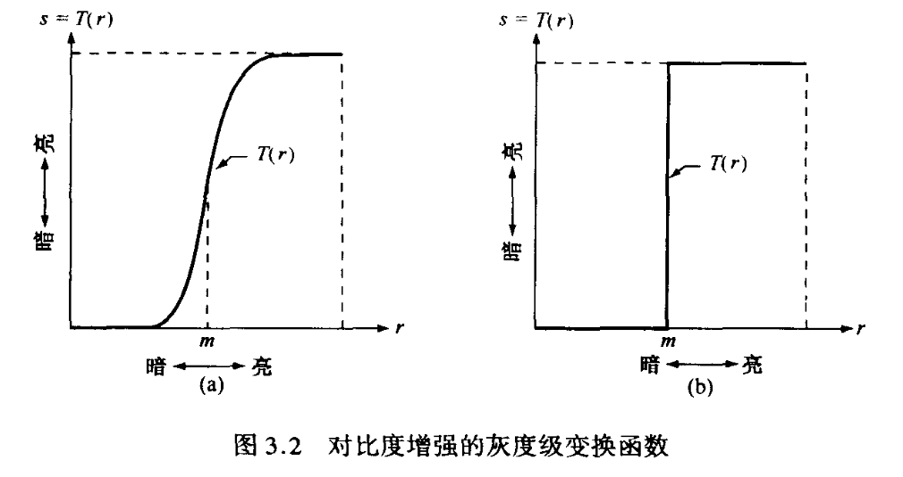
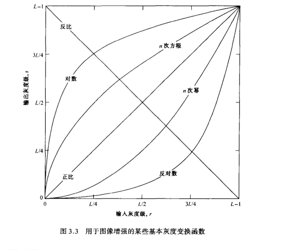
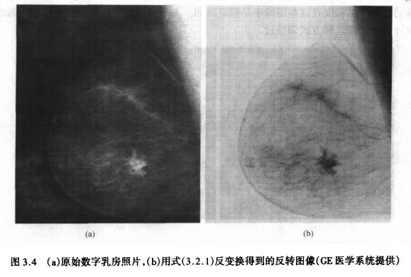
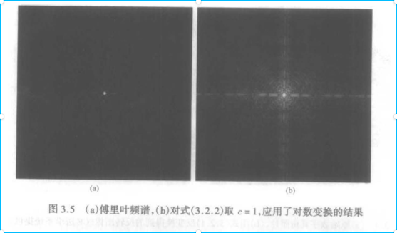
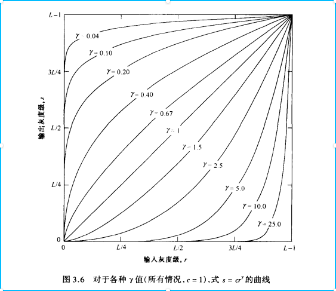
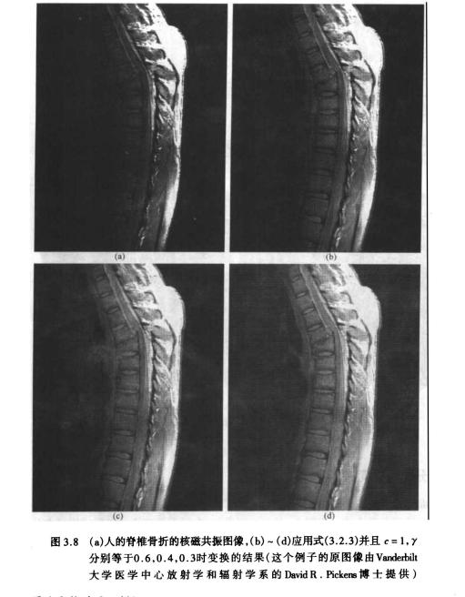
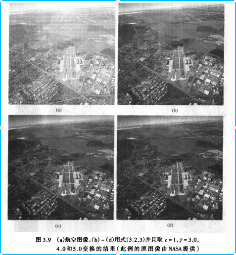
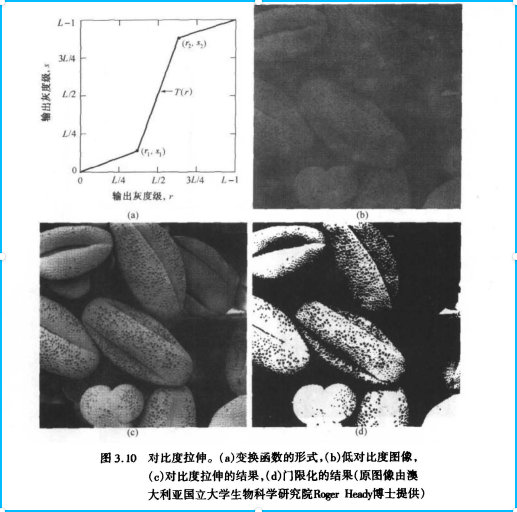
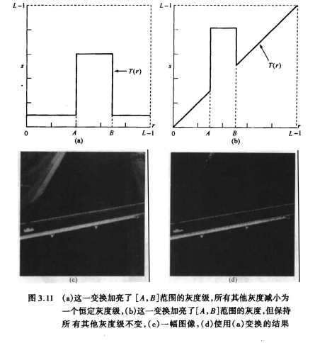

[TOC]

# 空间域图像增强

图像增强的首要目标是处理图像，使其比原始图像更适合与特定的应用。显示那些重要的细节，或突出一幅图像感兴趣的特征。

图像增强的方法分为两个大类：空间域方法和频域方法。空间域"一词是指图像平面自身，这类方法是以对图像的像素直接处理为基础的。"频域"处理技术是以修改图像的傅氏变换为基础的。

## 背景知识

“空间域增强”是指增强构成图像的像素。空间域方法是直接对这些像素操作的过程。空间域处理可由下式定义：
$$
g(x,y)=T[f(x,y)]\quad(3.1.1)
$$
其中f（x，y）是输入图像，g（x，y）是处理后的图像，T是对 f 的一种操作，其定义在（x，y）的领域。另外，T 能对输入图像集进行操作，例如，为减少噪音而对 K 幅图像进行逐像素的求和操作。

T 操作最简单的形式是领域为1x1的尺度（即单个像素）。在这种情况下，g仅仅依赖于 f 在（x，y）点的值，T操作称为灰度级变换函数（也叫强度映射），形式为：
$$
s =  T(r)
$$
这里，令 r 和 s 是所定义的变量，分别是f（x，y）和g（x，y）在任意点（x，y）的灰度级。下图3.2展示通过 T 操作提高原始图像的对比度，进行变换时，在原始图像中，灰度级低于 m 时变暗，而灰度级在 m 以上时变亮。图（a）中 s 型变成图（b）中阶梯型。

## 部分基本灰度变换

图3.3显示了图像增强常用的三个基本类型函数：线性的（正比和反比）、对数的（对数和反对数变换）、幂次的（n次幂和n次方根变换）。

### 图像反转

灰度级范围为[0,L-1]的图像反转可由图3.3的反比变换获得，表达式为：
$$
s = L-1-r
$$

用这种方式倒转图像的强度（灰度值）产生图像反转的对等图像 。 这种处理尤其适用于增强嵌入于图像暗色区域的白色或灰色细节，特别是当黑色面积占主导地位时 。一个例子示于图 3 .4，原始图像为 一 乳房的数字 X 照片，可看到有一小块病变 。尽管事实上两幅图在视觉内容上都一样，但注意，在这种特殊情况下，分析乳房组织结构时反转图像要容易得多。

### 对数变换

对数变换的一般表达式为：
$$
s = c \quad  log(1+r)
$$
其中 c 是一个常数，并假设 r ≥ 0 。此种变换使一窄带低灰度输入图像值映射为一个宽带输出值。

如何理解这块知识点，从图3.3，可知x轴是输入图像的灰度级，y轴是输出图像的灰度级，不进行任何变化的情况下输入图像的灰度级和输出图像的灰度级是正比关系，经过**对数变换**后曲线发生了改变，变成上凸的形状，其表达的意思是原本较低灰度值（亮度）区域亮度值提升了，直观的表现形式就是由于拍摄时光线不足导致一些原本一些细节变得过于暗淡导致看不见，图3.5展示**对数变换**后的效果

### 幂次变换（伽马变换）

幂次变换的基本形式为：
$$
s = cr^γ
$$
其中 c 和 γ 是正常数。从图3.6可知虽然幂次变换和对数变换同样能改变图像的对比度，但是实际上二者是不同的，幂次变换可以通过改变 γ 值的大小简单地得到一族变换曲线，而且 γ > 1和 γ < 1 产生的曲线有相反的效果。

再看两个利用幂次变换进行对比度增强的例子

### 分段线性变换函数

**分段线性变换函数**相比前面所讨论函数的主要优势在于它的形式可任意合成。其主要缺点是需要更多的用户输入

**对比拉伸**

最简单的分段线性函数之一是对比拉伸变换。低对比度图像可由照明不足、成像传感器动态范围太小，甚至在图像获取过程中透镜光圈设置错误引起。对比拉伸的思想是提高图像处理时灰度级的动态范围。

图3.10展示了根据分段线性函数的办法改变不同区间的灰度值（亮度）

当然还有其他形式的分段函数，这里就不详细的讲解，而只是了解一下

**灰度切割**

