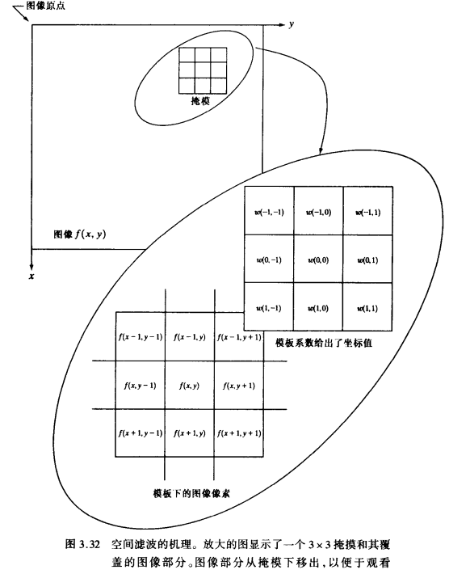

[TOC]

# 图像增强——空间滤波

空间滤波的机理，就是在待处理图像中逐点地移动掩模。在没一点（x，y）处，滤波器在该点的响应通过事先定义的关系来计算。

对于线性空间滤波，其响应由滤波器系数与滤波掩模扫过区域的对应像素值的乘积之和给出。图3.32所示为3x3的掩模，在图像中的点（x，y）处，用该掩模线性滤波的响应R为：

## 平滑空间滤波器

平滑滤波器用于模糊处理和减小噪声。模糊处理经常用于预处理，例如，在提取大的目标之前去除图像中一些琐碎的细节、桥接直线或曲线的缝隙。通过线性滤波器和非线性滤波器的模糊处理可以减小噪声。

### 平滑线性滤波器

平滑线性空间滤波器的输出（响应）是包含在滤波掩模领域内像素的简单平均值。因此，这些滤波器也称为均值滤波器。

平滑线性滤波器是用滤波掩模确定的领域内像素的平均灰度值去代替图像每个像素点的值，这种处理减小了图像灰度的“尖锐”变化。由于典型的随机噪声由灰度级的尖锐变化组成,因此,常见的平滑处理应用就是减噪。然而，由于图像边缘（几乎总是一幅图像希望有的特性）也是由图像灰度尖锐变化带来的特性,所以均值滤波处理还是存在着不希望的边缘模糊的负面效应。另外，这类处理还有一些其他应用，比如由于灰度量级不足而引起的伪轮廓效应的平滑处理。均值滤波器的主要应用是去除图像中不相干细节，其中“不相干”是指与滤波掩模尺寸相比，较小的像素区域。

第一种掩模，产生像素平均值，

第二种掩模，加权平均，指用不同的系数乘以像素，从权重上看，一些像素比另一更为重要。

例子。。。

### 统计排序滤波器

统计滤波器是一种非线性的空间滤波器，它的相应基于图像滤波器包围的图像区域中像素的排序，然后由统计排序结果决定的值代替中心像素的值。统计滤波器中最常见的例子就是中值滤波器，它是将像素（在中值计算中包括的原像素值）领域内灰度的中值代替该像素值。中值滤波器的使用非常普遍,这是因为对于一定类型的随机噪声，它提供了一种优秀的去噪能力,比小尺寸的线性平滑滤波器的模糊程度明显要低。中值滤波器对处理脉冲噪声(也称为椒盐噪声)非常有效,因为这种噪声是以黑白点叠加在图像上的。

例子。。。

## 锐化空间滤波器

锐化处理的主要目的是突出图像中的细节或者增强被模糊了的细节，这种模糊不是由于错误操作，就是特殊图像获取方法的固有影响。

### 基于二阶微分的图像增强——拉普拉斯算子

### 基于一阶微分的图像增强——梯度法

## 混合空间增强法

