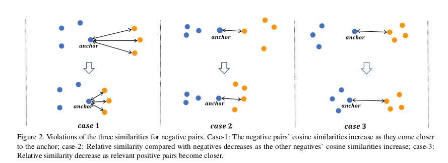
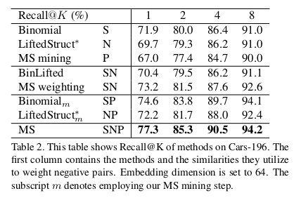
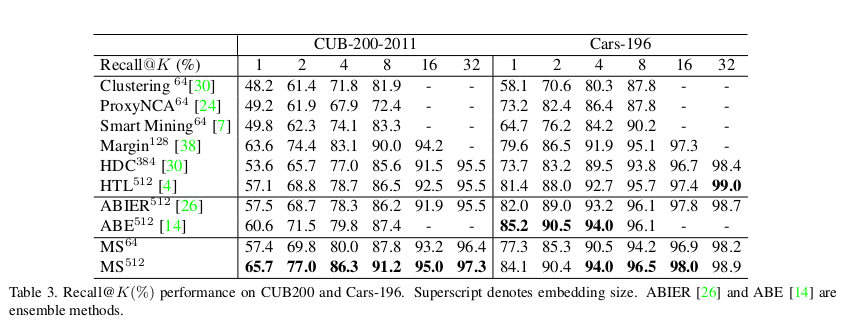
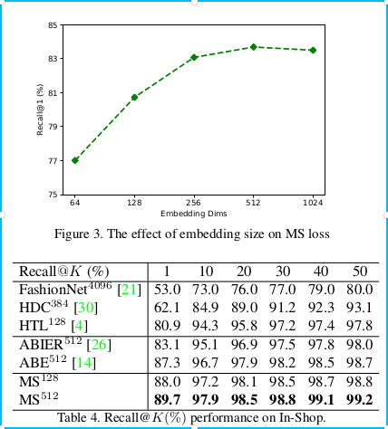
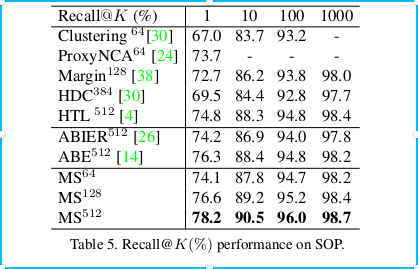

## Multi-Similarity Loss with General Pair Weighting for Deep Metric Learning

深度度量学习中多相似度损失的通用样本对加权

http://www.cet.com.cn/xwsd/2272309.shtml

论文链接：https://arxiv.org/pdf/1904.06627.pdf

代码：https://github.com/MalongTech/research-ms-loss 【暂时代码还没上传】

General Pair Weighting(GPW)是一种通用样本对加权框架，它希望从底层理解图像检索中的损失函数(深度度量学习)。简单而言，GPW 通过梯度分析将深度度量学习转化为样本对的加权问题，为理解基于样本对的损失函数提供了统一的视角和有力的工具。

### 摘要

文献中提出了一系列基于样本对计算的损失函数，为深度度量学习提供了大量的解决方案。在本文中，我们提供了一个通用的加权框架来理解最近的基于对的损失函数。在本文，我们提供了一个通用的加权框架（General Pair Weighting，GPW）来理解最近的基于样本对的损失函数。我们的贡献主要有三个方面：（1）我们建立了一个通用的样本对加权框架，通过梯度分析将深度度量学习的抽样问题转化为样本对加权的统一观点，为理解最近的基于样本对的损失函数提供了一个有力的工具；（2）通过GPW我们表明了，对现有的各种基于样本对的方法可以进行全面对比和讨论，并识别出明显的差异和关键限制；（3）我们提出了一个新的损失称为GPW下的多重相似性损失（MS loss），该损失通过两个迭代步骤（即挖掘和加权）实现。这使得它可以充分考虑样本对权重的三个相似之处，为收集和加权信息样本对提供了一种更为规范的方法。最后，提出的 MS 损失在四个图像检索基准上都取得了最优越的性能，它比最近的方法（如ABE和HTL）有较大的优势，例如CUB200从60.6%提升到65.7%，在数据集 In-Shop Clothes Retrievel上的召回率从80.9%提升到了88.0%

### General Pair Weighting（GPW）

在这部分，我们提出了将度量学习中的抽样问题转化为一个统一的权重观点，并为分析各种基于样本对的损失函数提供一个通用的样本对加权框架

公式推导。。。

从公式推导的最终结果可以得出，**通过区分两个不同类别（形成一个负对）的相似样本，将相似度较高的负对赋予较大的权重，这意味着它具有更多的信息。**

### Multi-Similarity Loss

提出一个多相似度损失，它综合考虑迭代样本挖掘和加权的三个相似性

三个相似性：S：Self-similarity, N: Negetive relative similarity, P: Positive relative similarity

S：Self-similarity，自相似性是根据对本身计算出来的，这是最重要的相似性。一个负对具有较大的余弦相似性意味着很难从不同类中区分两个成对的样本。这类样本对被称为硬负对（hard negative paris），对学习是被更具信息性和意义。对比损失和二项偏差损失都是基于此标准。如图2的case1所示，当负对样本靠近时，三个负对的权重增加。

显然，自相似性很难在嵌入空间中（embedding space）完全描述样本的分布，而且其他样本对之间的相关性对相似性度量造成很大的冲击。我们通过考虑与当前样本对具有相同anchor的所有样本对，来引入相关相似性并定义了两类相对相似性。

N: Negetive relative similarity,通过考虑相邻负对之间的关系来计算。如图2的case2所示，即使在自相似性不变的情况下，样本对的相似性也会降低。这是由于相邻负样本对移动得更近，从而增加了这些相邻对的自相似性，从而降低了相对相似性。基于这种相对相似性提升结构损失。

P: Positive relative similarity，同样，相对相关性也考虑来自其他正样本对（拥有相同的anchor）这种关系。如图2的case3所示，当这些正样本靠近anchor，当前样本对的相对相似性就会降低，因此这些样本对的权重也会相应的降低。Triplet 损失居士基于这种相似性。

据我们所知，现有的基于配对的方法都不能同时考虑这三种相似性。为此，我们提出了一个多重相似度（ms）损失，该损失考虑了所有三个方面，通过使用两个迭代步骤实现一个新的成对加权方案：挖掘和加权。

（1）信息对，首先通过相似性 P: Positive relative similarity进行采用

（2）再通过相似度s和相似度n对所选的信息对进行进一步加权。

### 实验

### 结论

我们提出了一种新的基于多相似度损失的深度度量学习，并建立了一个将现有的基于样本对的度量学习方法统一为一般样本对的通用加权框架。GPW为理解和解释不同的基于样本对的损失函数提供了强有力工具，使得我们能清楚的认识到现有方法的主要区别和关键局限性。在此基础上，我们提出了一个同时考虑三个相似性的多重相似性损失，并提出了一种有效优化多相似度损失的迭代样本对的挖掘和加权方案。我们的方法在许多图像检索基准上都取得了新的高度。

